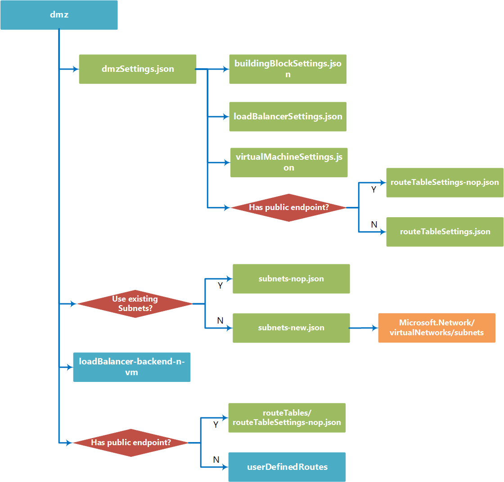

# DMZ
You can use the DMZ template building block to create a DMZ capable of allowing access to specific network resources while keeping the rest of your network safely isolated from external users. It can be used to secure both traffic between Azure and your on-premises datacenter, and Azure and the Internet. 

The block can create its own subnets, set up a [load balancer](https://github.com/mspnp/template-building-blocks/tree/master/scenarios/loadBalancer-backend-n-vm), and [add VMs](https://github.com/mspnp/template-building-blocks/tree/master/scenarios/multi-vm-n-nic-m-storage) to handle the IP routing required for DMZ access restriction.

**Note** This building block deploys the VMs used as network virtual appliances (NVAs) as Ubuntu servers with routing enabled. You need to use your own images, or images from the Azure marketplace, to deploy third party NVAs.

## Parameters
You need to configure two parameters for this building block, **dmzSettings** and **virtualNetworkSettings**.

### dmzSettings
The **dmzSettings** parameter contains most of the configuration options used to deploy the DMZ. It contains the following properties:

- **namePrefix**  
  Required. The name prefix is applied to all VMs, appliances, availability sets, and NICs created by this template. For example, and namePrefix of **public-dmz** will result in VMs named **public-dmz-vm1**, **public-dmz-vm2**, etc...  
  ```json
  "namePrefix": "internet-dmz"
  ``` 
- **endpoint**  
  Required. The endpoint property configures the DMZ endpoint. it contains the following properties:
  - **hasPublicEndpoint** - Required. Specifies if DMZ faces the public internet or not. (**yes** or **no**) If "yes" the deployment will create a public IP for the load balancer used by the NVAs.
  - **internalLoadBalancerSettings** - Required. Configures the load balancer endpoint if the DMZ is not public facing. Leave empty if the DMZ is public facing.  
    - **privateIPAddress** - Optional. The private IP address to use for the load balancer. 
    - **subnetName** - Optional. Subnet the internal load balancer is attached to. 
  ```json
  "endpoint": {
    "hasPublicEndpoint": "no",
    "internalLoadBalancerSettings": {
      "privateIPAddress": "10.0.0.10",
      "subnetName": "dmz-in"
    }
  }
  ```
- **applianceSettings**  
  Required. The applianceSettings property is an object that defines the configuration of the DMZ's load balancer and VMs that will perform routing between the external and internal networks. It contains the following properties:
  - **ports** - Required. An array of one or more port settings that will define a load balancer rule. Each port definition requires the following information:
    - **port** - Required. Port number of load balancing rule.
    - **protocol** - Required. Protocol of load balancing rule. ("Tcp" or "Udp")
    - **healthProbe** - Required. Name of probe to use for checking VM status for this rule. 
    ```json
    "ports": [
      {
        "port": 80,
        "protocol": "Tcp",
        "healthProbe": "hp1"
      }
    ]
    ```
  - **healthProbes** - Required. An array of one or more probe settings, which are used to create load balancer probes which get used to determine the health of the individual VMs providing firewall services. Each probe setting contains the following:    
    - **name** - Required. Name of probe.
    - **port** - Required. Port to check for machine health.
    - **protocol** - Required. Type of probe check. ("Http" or "Tcp")
    - **requestPath** - Optional. Path on remote machine to check for Http status. (Not used for probes using the "Tcp" protocol check, required when using "http")
    ```json
    "healthProbes": [
      {
        "name": "hp1",
        "port": 80,
        "protocol": "http",
        "requestPath": "/"
      }
    ]
    ```
  - **virtualMachineSettings** - Required. Configures the VMs that the DMZ uses to perform firewall and routing services between the external and internal networks. Note that this block only creates linux VMs to perform these services. It contains the following settings:
    - **count** - Required. The number of VMs to create.
    - **size** - Required. Size of the VMs to create. Note that this block uses [premium storage](https://azure.microsoft.com/en-us/documentation/articles/storage-premium-storage/), and only supports VM sizes that make use of premium storage. See [Sizes for virtual machines in Azure](https://azure.microsoft.com/en-us/documentation/articles/virtual-machines-windows-sizes/) for more information.
    - **adminUsername** - Required. Administrator user name for logging into the VM's OS. 
    - **adminPassword** - Optional. Administrator user name for logging into the VM's OS. (Required if osAuthenticationType = "password")
    - **sshPublicKey** - Optional. SSH key used to log into the VM OS's Administrator account. (Required if osAuthenticationType = "ssh")
    - **osAuthenticationType** - Required. Login authentication type. ("password" or "ssh") 
    - **imageReference** - Required. The imageReference property defines the operating system installed on the VMs you're creating. Note that only Linux based images can be used for VMs in this block it contains the following properties:
      - **publisher** - Required. OS publisher
      - **offer** - Required. OS Offering 
      - **sku** - Required. OS Product SKU 
      - **version** - Required. OS Version (specific version number or "latest")
    ```json
    "virtualMachineSettings": {
      "count": 2,
      "size": "Standard_DS2_v2",
      "adminUsername": "testuser",
      "adminPassword": "AweS0me@PW",
      "sshPublicKey": "",
      "osAuthenticationType": "password",
      "imageReference": {
        "publisher": "Canonical",
        "offer": "UbuntuServer",
        "sku": "14.04.5-LTS",
        "version": "latest"
      }
    }
    ```
  - **extensions** - Required. The extensions property is an array of one or more extension definition object, which allows you to specify any [VM Extensions](https://github.com/Azure/azure-content/blob/master/includes/virtual-machines-common-extensions-features.md) you want loaded on the DMZ VMs.  
  
      Note that although you can use the extensions mechanism to install and configure any number of VM extensions (as is possible in the [multi-vm-n-nic-m-storage](https://github.com/mspnp/template-building-blocks/tree/master/scenarios/multi-vm-n-nic-m-storage) template building block), the primary purpose for it in this block is defining the iptables firewall that get deployed on the DMZ VMs.    
  
     Each definition contains the following properties:
    - **name** - Required. Defines the display name of this extension. 
    - **publisher** - Required. Extension publisher name.
    - **type** - Required. Extension type. If configuring IP Tables, should be
    - **typeHandlerVersion** - Required. Extensions version to use.
    - **autoUpgradeMinorVersion** - Required. Sets if the extension is allowed to upgrade automatically. (true / false)
    - **settingsConfigMapperUri** - Required. URL of template used during the deployment process. Should always be "https://raw.githubusercontent.com/mspnp/template-building-blocks/master/templates/resources/Microsoft.Compute/virtualMachines/extensions/vm-extension-passthrough-settings-mapper.json"
    - **settingsConfig** - Required. Object containing extension specific settings. Can be empty.
    - **protectedSettingsConfig** - Required. Object containing extension specific settings that need to be encrypted. Can be empty. 

    If configuring the IP Table Firewall for your DMZ VMs, your extensions definition should look like this:
  
    ```json
    "extensions": [
      {
        "name": "enable-iptables-routes",
        "publisher": "Microsoft.OSTCExtensions",
        "type": "CustomScriptForLinux",
        "typeHandlerVersion": "1.5",
        "autoUpgradeMinorVersion": true,
        "settingsConfigMapperUri": "https://raw.githubusercontent.com/mspnp/template-building-blocks/master/templates/resources/Microsoft.Compute/virtualMachines/extensions/vm-extension-passthrough-settings-mapper.json",
        "settingsConfig": {
          "fileUris": [
            "https://raw.githubusercontent.com/mspnp/template-building-blocks/master/templates/resources/Microsoft.Compute/virtualMachines/extensions/linux/enable-iptables-routes/enable-iptables-routes.sh"
          ],
          "commandToExecute": "bash enable-iptables-routes.sh public 10.0.1.100"
        },
        "protectedSettingsConfig": { }
      }
    ]
    ```

    In CustomScriptForLinux extension type, there are two values you need to provide in the settingsConfig section, fileUris and commandToExecute:
    - **fileUris** - Allows you to provide an array of URIs pointing to one or more bash shell scripts that will be available for the VMs to execute. In the case of the DMZ setup, this should point to a script that configures the ip tables routes on the linux VM (see the URI in the example for a sample script file that enables port 80 and 443 forwarding).
    - **commandToExecute** - Executes a shell command on the linux VM, allowing you to execute the scripts specified by the fileUris setting. For the example script file, you need to pass two parameters indicating if the DMZ endpoint is public facing or not, and the IP address of the internal routing target.  
      
- **securedAddressSpace**  
  Required. The securedAddressSpace property is an array of CIDR blocks defining the secured internal subnets that the DMZ can communicate with.
  ```json
  "securedAddressSpace": [ "10.0.1.0/24", "10.0.2.0/24" ],
  ```

- **subnets**  
  Required. The subnets object defines the subnets used by the NICs handling traffic traffic through the DMZ. It has the following properties:  
  - **useExistingSubnets** - Required. Sets whether the block will use pre-existing subnets or create new ones.  
    - **inSubnet** - Required. Settings for the subnet handling traffic coming from the unsecured external network. It has the following properties. 
      - **name** - Required. Name of subnet to use.
      - **addressPrefix** - Required. CIDR block to use when defining new subnet. Leave empty if using existing subnet.
    - **outSubnet** - Required. Settings for the subnet handling traffic going to the secured internal network. It has the following properties. 
      - **name** - Required. Name of subnet to use.
      - **addressPrefix** - Required. CIDR block to use when defining new subnet. Leave empty if using existing subnet.
  ```json
  "subnets": {
    "useExistingSubnets": "no",
    "inSubnet": {
      "name": "dmz-in",
      "addressPrefix": "10.0.0.0/27"
    },
    "outSubnet": {
      "name": "dmz-out",
      "addressPrefix": "10.0.0.32/27"
    }
  }
  ```

### virtualNetworkSettings
The virtualNetworkSettings parameter is an object that specifies the VNet and resource group associated with your DMZ. It contains the following properties:

- **name**  
   Required. Name of the VNet that this DMZ will be created for.   
	```json
	"name": "bb-dev-vnet"
	```

- **resourceGroup**  
Required. Azure Resource Group the DMZ belongs to.  
  ```json
  "resourceGroup": "bb-dev-rg"
  ```


## Sample parameters file

The following parameters file will create a public facing DMZ. It creates a load balancer with a public IP address, incoming and outgoing subnets, two VMs each with one NIC attached to the incoming subnet and a second to the outgoing, and configures the balancer rules and firewall settings to allow port 80 and 443 traffic to pass along to a specific IP on the internally secured network.    

```json
{
  "$schema": "http://schema.management.azure.com/schemas/2015-01-01/deploymentParameters.json#",
  "contentVersion": "1.0.0.0",
  "parameters": {
    "dmzSettings": {
      "value": {
        "namePrefix": "internet-dmz",
        "endpoint": {
          "hasPublicEndpoint": "yes",
          "internalLoadBalancerSettings": { }
        },
        "applianceSettings": {
          "ports": [
            {
              "port": 80,
              "protocol": "Tcp",
              "healthProbe": "hp1"
            }
          ],
          "healthProbes": [
            {
              "name": "hp1",
              "port": 80,
              "protocol": "http",
              "requestPath": "/"
            }
          ],
          "virtualMachineSettings": {
            "count": 2,
            "size": "Standard_DS2_v2",
            "adminUsername": "testuser",
            "adminPassword": "AweS0me@PW",
            "sshPublicKey": "",
            "osAuthenticationType": "password",
            "imageReference": {
              "publisher": "Canonical",
              "offer": "UbuntuServer",
              "sku": "14.04.5-LTS",
              "version": "latest"
            },
            "extensions": [
              {
                "name": "enable-iptables-routes",
                "publisher": "Microsoft.OSTCExtensions",
                "type": "CustomScriptForLinux",
                "typeHandlerVersion": "1.5",
                "autoUpgradeMinorVersion": true,
                "settingsConfigMapperUri": "https://raw.githubusercontent.com/mspnp/template-building-blocks/master/templates/resources/Microsoft.Compute/virtualMachines/extensions/vm-extension-passthrough-settings-mapper.json",
                "settingsConfig": {
                  "fileUris": [
                    "https://raw.githubusercontent.com/mspnp/template-building-blocks/master/templates/resources/Microsoft.Compute/virtualMachines/extensions/linux/enable-iptables-routes/enable-iptables-routes.sh"
                  ],
                  "commandToExecute": "bash enable-iptables-routes.sh public 10.0.1.100"
                },
                "protectedSettingsConfig": { }
              }
            ]
          }
        },
        "securedAddressSpace": [ "10.0.1.0/24", "10.0.2.0/24" ],
        "subnets": {
          "useExistingSubnets": "no",
          "inSubnet": {
            "name": "dmz-in",
            "addressPrefix": "10.0.0.0/27"
          },
          "outSubnet": {
            "name": "dmz-out",
            "addressPrefix": "10.0.0.32/27"
          }
        }

      }
    },
    "virtualNetworkSettings": {
      "value": {
        "name": "bb-dev-vnet",
        "resourceGroup": "bb-dev-rg"
      }
    }
  }
}

```


## Deployment

You can deploy a building block by using the Azure portal, PowerShell, or Azure CLI. The examples below show how to deploy the building block using the sample parameters file above.

### Azure portal

Note that the building block deployment process will require you store your parameters file in a location with a publicly available URI, which you provide during deployment.

[](https://portal.azure.com/#create/Microsoft.Template/uri/https%3A%2F%2Fraw.githubusercontent.com%2Fmspnp%2Ftemplate-building-blocks%2Fmaster%2Fscenarios%2Fdmz%2Fazuredeploy.json)  

1. Click the above deployment button, the Azure portal will be opened.
1. In the deployment's **TEMPLATEPARAMETERURI** parameter, specify the public URI where your parameters file is located. 
2. Specify or create the Resource Group where you want the VNet deployed to.
3. Click the **Create** button.

### PowerShell

You can use the **New-AzureRmResourceGroupDeployment** to deploy the building block template using a parameter file located at a publicly available URI.

1. Upload a parameters file to a location with a publicly available URI.
2. If you do not have an existing resource group, run the **New-AzureRmResourceGroup** cmdlet as shown below.
```PowerShell
New-AzureRmResourceGroup -Location <Target Azure Region> -Name <Resource Group Name> 
```
3. Run the **New-AzureRmResourceGroupDeployment** cmdlet as shown below.
```PowerShell
New-AzureRmResourceGroupDeployment -ResourceGroupName <Resource Group Name>
  -TemplateUri https://raw.githubusercontent.com/mspnp/template-building-blocks/master/scenarios/dmz/azuredeploy.json 
  -templateParameterUriFromTemplate <URI of parameters file>
```

**Example**  
The cmdlet below creates a resource group named **app1-rg** in the **westus** location, and then deploys dmz building block using a parameter file hosted in Azure blob storage.

```PowerShell
New-AzureRmResourceGroup -Location westus -Name app1-rg 
New-AzureRmResourceGroupDeployment -ResourceGroupName app1-rg -TemplateUri https://raw.githubusercontent.com/mspnp/template-building-blocks/master/scenarios/dmz/azuredeploy.json   -templateParameterUriFromTemplate http://buildingblocksample.blob.core.windows.net/building-block-params/vnet.parameters.json
```

### Azure CLI

To deploy the building block using a parameters file available from a URI:

1. Upload a parameters file to a location with a publicly available URL.
2. If you do not have an existing resource group, create a new one using the following command:
```AzureCLI
  azure group create -n <Resource Group Name> -l <Target Azure Region>
```

  
3. Run the command shown below to deploy the VNet
```AzureCLI
azure config mode arm
azure group deployment create <Resource Group Name>
  --template-uri https://raw.githubusercontent.com/mspnp/template-building-blocks/master/scenarios/dmz/azuredeploy.json 
  -p "{\"templateParameterUri\":{\"value\":\"<parameters File Public URI>\"}}"
```

**Example**  
The command below creates a resource group named **app1-rg** in the **westus** location, and then deploys a dmz building block using a parameter file hosted in Azure blob storage.

```AzureCLI
azure group create -n "app1-rg" -l "West US"
azure config mode arm
azure group deployment create app1-rg --template-uri https://raw.githubusercontent.com/mspnp/template-building-blocks/master/scenarios/dmz/azuredeploy.json -p "{\"templateParameterUri\":{\"value\":\"http://buildingblocksample.blob.core.windows.net/building-block-params/vnet.parameters.json\"}}"
```

## Extending the building block

You can extend existing building blocks, and create your own building blocks. Each building block is created using a set of templates. The flowchart below represents the different templates used to create the DMZ building block.

