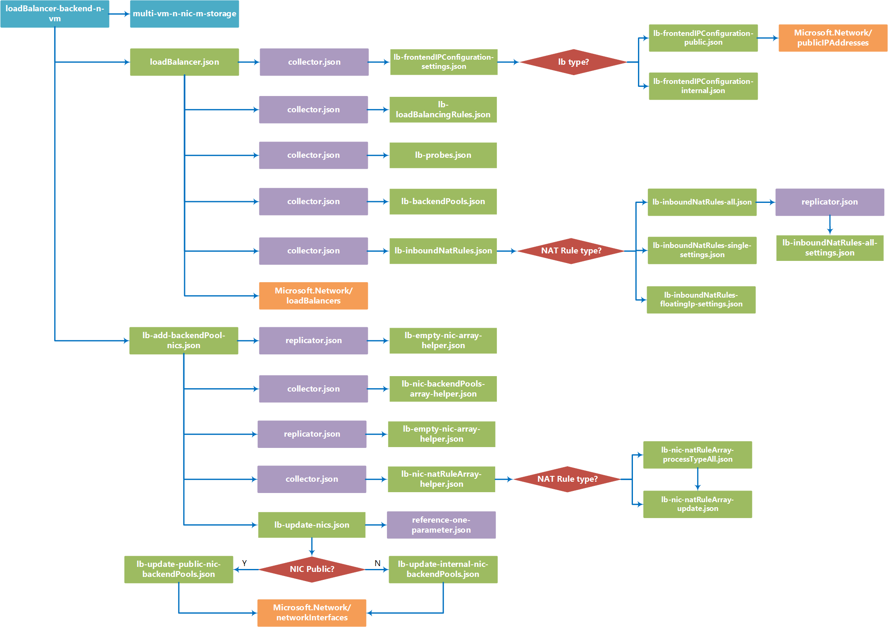

# loadBalancer-backend-n-vm

You can use the loadBalancer-backend-n-vm template building block to create an [Azure Load Balancer](https://azure.microsoft.com/en-us/documentation/articles/load-balancer-overview/), and populate that load balancer with an available set containing one or more newly created VMs. 

The building block supports both public and internal load balancers, and allows you to specify custom balancer rules, frontend and backend IP pools, [probes](https://azure.microsoft.com/en-us/documentation/articles/load-balancer-custom-probe-overview/), and NAT rules. VMs support custom OS configuration, NIC provisioning, drives setup, and VM extension installation. 
     

## Parameters

You need to specify four parameters in this building block, named **loadBalancerSettings**, **virtualMachinesSettings**, **virtualNetworkSettings**, and **buildingBlockSettings**. 

### loadBalancerSettings
The **loadBalancerSettings** parameter configures the Azure Load Balancer. It contains the following properties:

- **name**  
   Required. Name of the load balancer you are deploying.   

		"name": "bb-dev-web-lb"

- **frontendIPConfigurations**  
The frontendIPConfigurations parameter is an array of one or more frontend IP Pool configuration objects. These objects contain the following:
  - **name** - Required. Name of the frontend IP pool.
  - **loadBalancerType** - Required. Type of load balancer. ("internal" or "public")
  - **internalLoadBalancerSettings** Configuration settings object for internal load balancer. Not used for public load balancers. Contains two properties:
    - **privateIPAddress** - Required. IP address of the load balancer. 
    - **subnetName** - Required. Subnet associated with the load balancer's private IP. 

			"frontendIPConfigurations": [
			{
			  "name": "lbfe1",
			  "loadBalancerType": "internal",
			  "internalLoadBalancerSettings": {
			    "privateIPAddress": "10.0.0.254",
			    "subnetName": "web"
			  }
			}
			]

- **loadBalancingRules**  
The loadBalancingRules parameter is an array of one or more rules which define how traffic is handled. each rule has the following properties:

  - **name** - Required. Name of the balancing rule.
  - **frontendPort** - Required. Port number of incoming traffic that this rule listens for.
  - **backendPort** - Required. Port number that traffic will be forwarded on the backend machines.
  - **protocol** - Required. Protocol that traffic forwarding applies to. ("Tcp" or "Udp")
  - **backendPoolName** - Required. Name of the backend IP pool.
  - **frontendIPConfigurationName** - Required. Name of the frontend IP pool.
  - **probeName** - Required. Name of the probe used to determine machine health.

			"loadBalancingRules": [
			{
			  "name": "lbr1",
			  "frontendPort": 80,
			  "backendPort": 80,
			  "protocol": "Tcp",
			  "backendPoolName": "lb-bep1",
			  "frontendIPConfigurationName": "lbfe1",
			  "probeName": "lbp1"
			},
			{
			  "name": "lbr2",
			  "frontendPort": 443,
			  "backendPort": 443,
			  "protocol": "Tcp",
			  "backendPoolName": "lb-bep2",
			  "frontendIPConfigurationName": "lbfe1",
			  "probeName": "lbp2"
			}
			]

- **probes**  
  The probes parameter is an array of one or more probe definition objects. Each definition has the following properties:
  - **name** - Required. Name of probe.
  - **port** - Required. Port to check for machine health.
  - **protocol** - Required. Type of probe check. ("Http" or "Tcp")
  - **requestPath** - Optional. Path on remote machine to check for Http status. (Not used for probes using the "Tcp" protocol check, required when using "http") 

			"probes": [
			{
			  "name": "lbp1",
			  "port": 80,
			  "protocol": "Http",
			  "requestPath": "/"
			},
			{
			  "name": "lbp2",
			  "port": 443,
			  "protocol": "Http",
			  "requestPath": "/"
			}
			]

- **backendPools**  
  The backendPools parameter creates the list of backend IP addresses the load balancer uses. it has two properties:
    - **name** - Required. Name of the pool.
    - **nicIndex** - Required. NIC to use for included VMs

			"backendPools": [
			{
			  "name": "lb-bep1",
			  "nicIndex": 0
			},
			{
			  "name": "lb-bep2",
			  "nicIndex": 0
			}
			]

- **inboundNatRules**  
The inboundNatRules parameter is an array of one or more NAT rules handling inbound traffic. It has the following properties:
  - **namePrefix** - Required. Name of this rule. 
  - **frontendIPConfigurationName** - Required.  Name of frontend pool this rule applies to. 
  - **startingFrontendPort** - Optional. If no specific vmIndex is specified, this property will set a NAT rule for each VM, incrementing this port number for each rule. (Rule must either have a **startingFrontendPort** or **frontendPort**)     
  - **frontendPort** - Optional. Specific frontend port this rule applies to. (Rule must either have a **startingFrontendPort** or **frontendPort**)
  - **backendPort** - Required. Backend port this rule redirects traffic to. 
  - **natRuleType** - Required. 
  - **protocol** - Required. Protocol to use for this rule. ("Tcp" or "Udp")
  - **vmIndex** - Optional. The index number of the virtual machine this rule targets. Required if using the frontendPort property. 
  - **nicIndex** - Required. The index number of the NIC on the target VM.  

			"inboundNatRules":[
			{
			  "namePrefix": "nat1",
			  "frontendIPConfigurationName": "lbfe1",
			  "startingFrontendPort": 50001,
			  "backendPort": 3389,
			  "natRuleType": "All",
			  "protocol": "Tcp",
			  "nicIndex": 0
			},
			{
			  "namePrefix": "nat2",
			  "frontendIPConfigurationName": "lbfe1",
			  "frontendPort": 9042,
			  "backendPort": 9042,
			  "natRuleType": "Single",
			  "protocol": "Tcp",
			  "vmIndex": 1,
			  "nicIndex": 0
			}
			]

### virtualMachinesSettings
The virtualMachinesSettings parameter contains the configuration settings the block will use when creating VMs for your load balancer deployment. It contains the following properties:

- **namePrefix**  
  Required. The namePrefix property is used to generate individual Azure VM names (note this is the Azure display name for the VM, not its OS host name). For instance, if your namePrefix is **test-machines** and you're creating 3 VMs, your Azure VM names will be **test-machines-vm1**, **test-machines-vm2**, and **test-machines-vm**.   

		"namePrefix": "bb-dev"

- **computerNamePrefix**
  Required. The computerNamePrefix property is used to generate individual host names for the VM's OS. For instance, if your computerNamePrefix is **host-machines*, and you're creating 3 VMs, your VM host names will be **host-machines-vm1**, **host-machines-vm2**, and **host-machines-vm3**. 

		"computerNamePrefix": "bb-dev"

- **size**  
  Required. Size of the VMs to create. Note that this block uses [premium storage](https://azure.microsoft.com/en-us/documentation/articles/storage-premium-storage/), and only supports VM sizes that make use of premium storage. See [Sizes for virtual machines in Azure](https://azure.microsoft.com/en-us/documentation/articles/virtual-machines-windows-sizes/) for more information.

		"size": "Standard_DS4_v2"

- **osType**  
  Required. Type of operating system that will be installed ("linux" or "windows").

		"osType": "windows"

- **adminUsername**  
  Required. Administrator user name for logging into the VM's OS. 

		"adminUsername": "testuser"

- **adminPassword**
  Administrator user name for logging into the VM's OS. (Only used if osAuthenticationType = "password") 

		"adminPassword": "AweS0me@PW"

- **sshPublicKey**  
  SSH key used to log into the VM OS's Administrator account. (Only used if osAuthenticationType = "ssh")

		"sshPublicKey": "ssh-rsa AAAAB3NzaC1yc2EAAAABJQAAAIEA0v5ZQ0BlLcbhYVvysYaHI4ELVLHRopH/K1u7fuqa+iN6mP/vem3AXwwkXTGcBrnjNx7ZWmP5IIqfx6LlNiBrQZQRKucoJ4q3B3X1uXMTUtTbnniK7fSBtAnqKhWi+tCK+k+BhdsPhEpBdHy/d+Xwr3nxZDVHTpPhxRKFOhboMos= rsa-key-20160908"
  
- **osAuthenticationType**  
  Required. Login authentication type. ("password" or "ssh") 

		"osAuthenticationType": "password"

  **Note** SSH authentication is only supported on Linux VMs.  

- **nics**  
  Required. The nics property contains an array of one or more network interface settings. Each interface definition contains the following properties:
  - **isPublic** - Required. Is this NIC accessible from outside it's VNet.  ("true" / "false")
  - **subnetName** - Required. Subnet the NIC is connected to.
  - **privateIPAllocationMethod** - Required. How is IP address assigned on private network? ("Static" / "Dynamic")
  - **publicIPAllocationMethod** - How is IP address assigned on private network?  ("Static" / "Dynamic")
  - **startingIPAddress** - If private IP is static, this is the IP assigned to this NIC on the first VM created. Additional VMs will increment this address by one.  
  - **enableIPForwarding** - Required. Enable IP forwarding for this NIC? (true / false) 
  - **dnsServers** - Required. Defines one or more custom DNS Server adresses of the NIC. Leave blank to use Azure internal name resolution. 
 
			"dnsServers": [ ] 
 
  - **isPrimary** - Required. Is this the primary NIC for VM? ("true"/"false")

			"nics": [
			{
			  "isPublic": "true",
			  "subnetName": "web",
			  "privateIPAllocationMethod": "Static",
			  "publicIPAllocationMethod": "Dynamic",
			  "startingIPAddress": "10.0.0.240",
			  "enableIPForwarding": true,
			  "dnsServers": [ ],
			  "isPrimary": "true"
			},
			{
			  "isPublic": "false",
			  "subnetName": "biz",
			  "privateIPAllocationMethod": "Dynamic",
			  "enableIPForwarding": false,
			  "dnsServers": ["10.0.0.220","10.0.1.233"],
			  "isPrimary": "false"
			}
			]

- **imageReference**  
Required. The imageReference property defines the operating system installed on the VMs you're creating. it contains the following properties:
  - **publisher** - Required. OS publisher
  - **offer** - Required. OS Offering 
  - **sku** - Required. OS Product SKU 
  - **version** - Required. OS Version (specific version number or "latest")

			"imageReference": {
				"publisher": "MicrosoftWindowsServer",
				"offer": "WindowsServer",
				"sku": "2012-R2-Datacenter",
				"version": "latest"
			}

- **dataDisks**
Required. The dataDisks property allows you to specify the number, size, and properties of any data disks you want created for your virtual machines. it contains the following properties:
  - **count** - Required. Number of data disks to create.
  - **properties** -  Required. Object that defines the details about the data disk. Contains:
    - **diskSizeGB** - Disk size in GB.
    - **Caching** - Disk caching setting. The options are "Read" (write through caching) and "ReadWrite" (write back caching), and "None".
    - **createOption** - Type of disk to create. Currently only "Empty" disks are supported.

			"dataDisks": {
				"count": 2,
				"properties": {
				  "diskSizeGB": 127,
				  "caching": "None",
				  "createOption": "Empty"
				}
			}

		  **Note** Data disks are optional, but the dataDisks property is required. If not using data disks, set the **count** properties to 0 and leave the **properties** property blank, as shown below. 
	
			"dataDisks": {
				"count": 0,
				"properties": { }
			}

- **osDisk**  
Required. The osDisk property is an object allowing you to specify the caching setting of the OS drive via a "caching" sub-property. The options are "Read" (write through caching) and "ReadWrite" (write back caching).

		"osDisk": {
			"caching": "ReadWrite"
		}

- **extensions**  
Required. The extensions property is an array of one or more extension definition object, which allows you to specify any [VM Extensions](https://github.com/Azure/azure-content/blob/master/includes/virtual-machines-common-extensions-features.md) you want loaded on your new VMs. Each definition contains the following properties:
  - **name** - Required. Defines the display name of this extension. 
  - **publisher** - Required. Extension publisher name. 
  - **type** - Required. Extension type.
  - **typeHandlerVersion** - Required. Extensions version to use.
  - **autoUpgradeMinorVersion** - Required. Sets if the extension is allowed to upgrade automatically. (true / false) 
  - **settingsConfig** - Required. Object containing extension specific settings. Can be empty.   
  - **protectedSettingsConfig** - Required. Object containing extension specific settings that need to be encrypted. Can be empty.

			"extensions": [
			{
			  "name": "IaaSAntimalware",
			  "publisher": "Microsoft.Azure.Security",
			  "type": "IaaSAntimalware",
			  "typeHandlerVersion": "1.3",
			  "autoUpgradeMinorVersion": true,
			  "settingsConfigMapperUri": "https://raw.githubusercontent.com/mspnp/template-building-blocks/master/templates/resources/Microsoft.Compute/virtualMachines/extensions/vm-extension-passthrough-settings-mapper.json",
			  "settingsConfig": {
			    "AntimalwareEnabled": true,
			    "RealtimeProtectionEnabled": "false",
			    "ScheduledScanSettings": {
			      "isEnabled": "false",
			      "day": "7",
			      "time": "120",
			      "scanType": "Quick"
			    },
			    "Exclusions": {
			      "Extensions": ".gif",
			      "Paths": "c:\\test",
			      "Processes": "test.exe"
			    }
			  },
			  "protectedSettingsConfig": { }
			},
			{
			  "name": "malware",
			  "publisher": "Symantec",
			  "type": "SymantecEndpointProtection",
			  "typeHandlerVersion": "12.1",
			  "autoUpgradeMinorVersion": true,
			  "settingsConfigMapperUri": "https://raw.githubusercontent.com/mspnp/template-building-blocks/master/templates/resources/Microsoft.Compute/virtualMachines/extensions/vm-extension-passthrough-settings-mapper.json",
			  "settingsConfig": {
			  },
			  "protectedSettingsConfig": { }
			}
			]

- **availabilitySet**  
Required. The availabilitySet property sets the availability set your new VMs will be included in. It contains two properties:
  - **name** - Required. Availabilty set name.
  - **useExistingAvailabilitySet** - Required. Does the availability set exist already? If "Yes", then the new VMs get added to it. if "No", then a new availability set will be created.

			"availabilitySet": {
				"useExistingAvailabilitySet": "No",
				"name": "bb-dev-as"
			}

### virtualNetworkSettings
The virtualNetworkSettings parameter is an object that specifies the VNet and resource group associated with this deployment. It contains the following properties:

- **name**  
   Required. Name of an existing VNet that this deployment will be associated with.   

		"name": "bb-dev-vnet"

- **resourceGroup**  
  Required. Azure Resource Group containing the VNet.  

		"resourceGroup": "bb-dev-rg"

### buildingBlockSettings
The buildingBlockSettings parameter provides the basic settings for how many VMs and storage accounts you want to create.
- **storageAccountsCount**
Required. Number of storage accounts to create.

	"storageAccountsCount": 2

- **vmCount**
Required. Number of VMs to create.

		"vmCount": 2

- **vmStartIndex**
 Required. Starting point for numbering VMs.

	    "vmStartIndex": 1

**Note** if there are fewer storage accounts created than VMs, the building block distributes the VMs across the storage accounts as evenly as possible. For example, if you create 2 storage accounts, and 6 VMs, three VMs will be deployed to each storage account. 

## Example parameters file

The following parameters file ...

	{
	  "$schema": "http://schema.management.azure.com/schemas/2015-01-01/deploymentParameters.json#",
	  "contentVersion": "1.0.0.0",
	  "parameters": {
	    "loadBalancerSettings": {
	      "value": {
	        "name": "bb-dev-web-lb",
	        "frontendIPConfigurations": [
	          {
	            "name": "bb-dev-lbfe1",
	            "loadBalancerType": "public"
	          }
	        ],
	        "loadBalancingRules": [
	          {
	            "name": "lbr1",
	            "frontendPort": 80,
	            "backendPort": 80,
	            "protocol": "Tcp",
	            "backendPoolName": "lb-bep1",
	            "frontendIPConfigurationName": "bb-dev-lbfe1",
	            "probeName": "lbp1"
	          }
	        ],
	        "probes": [
	          {
	            "name": "lbp1",
	            "port": 80,
	            "protocol": "Http",
	            "requestPath": "/"
	          }
	        ],
	        "backendPools": [
	          {
	            "name": "lb-bep1",
	            "nicIndex": 0
	          }
	        ],
	        "inboundNatRules": [ ]
	      }
	    },
	    "virtualMachinesSettings": {
	      "value": {
	        "namePrefix": "bb-dev-web",
	        "computerNamePrefix": "bb-dev-web",
	        "size": "Standard_DS2_v2",
	        "osType": "windows",
	        "adminUsername": "testuser",
	        "adminPassword": "AweS0me@PW",
	        "osAuthenticationType": "password",
	        "nics": [
	          {
	            "isPublic": "false",
	            "subnetName": "web",
	            "privateIPAllocationMethod": "Static",
	            "startingIPAddress": "10.0.1.101",
	            "enableIPForwarding": false,
	            "dnsServers": [
	            ],
	            "isPrimary": "true"
	          }
	        ],
	        "imageReference": {
	          "publisher": "MicrosoftWindowsServer",
	          "offer": "WindowsServer",
	          "sku": "2012-R2-Datacenter",
	          "version": "latest"
	        },
	        "dataDisks": {
	          "count": 1,
	          "properties": {
	            "diskSizeGB": 127,
	            "caching": "None",
	            "createOption": "Empty"
	          }
	        },
	        "osDisk": {
	          "caching": "ReadWrite"
	        },
	        "extensions": [
	          {
	            "name": "iis-config-ext",
	            "settingsConfigMapperUri": "https://raw.githubusercontent.com/mspnp/template-building-blocks/master/templates/resources/Microsoft.Compute/virtualMachines/extensions/vm-extension-passthrough-settings-mapper.json",
	            "publisher": "Microsoft.Powershell",
	            "type": "DSC",
	            "typeHandlerVersion": "2.20",
	            "autoUpgradeMinorVersion": true,
	            "settingsConfig": {
	              "modulesUrl": "https://raw.githubusercontent.com/mspnp/reference-architectures/master/ra-multi-vm-extend/guidance-compute-multi-vm/extensions/windows/iisaspnet.ps1.zip",
	              "configurationFunction": "iisaspnet.ps1\\iisaspnet"
	            }
	          }
	        ],
	        "availabilitySet": {
	          "useExistingAvailabilitySet": "No",
	          "name": "bb-dev-lb-as"
	        }
	      }
	    },
	    "virtualNetworkSettings": {
	      "value": {
	        "name": "bb-dev-vnet",
	        "resourceGroup": "bb-dev-rg"
	      }
	    },
	    "buildingBlockSettings": {
	      "value": {
	        "storageAccountsCount": 2,
	        "vmCount": 3,
	        "vmStartIndex": 1
	      }
	    }
	  }
	}

<!-- Image goes here -->

## Deployment

You can deploy a building block by using the Azure portal, PowerShell, or Azure CLI. The examples below show how to deploy the building block using the sample parameters file above.

### Azure portal

Note that the building block deployment process will require you store your parameters file in a location with a publicly available URI, which you provide during deployment.

  

1. Click the above deployment button, the Azure portal will be opened.
1. In the deployment's **TEMPLATEPARAMETERURI** parameter, specify the public URI where your parameters file is located. 
2. Specify or create the Resource Group where you want the VNet deployed to.
3. Click the **Create** button.

### PowerShell

You can use the **New-AzureRmResourceGroupDeployment** to deploy the building block template using a parameter file located at a publicly available URI.

1. Upload a parameters file to a location with a publicly available URI.
2. Run the **New-AzureRmResourceGroupDeployment** cmdlet as shown below.

		New-AzureRmResourceGroupDeployment -ResourceGroupName <Resource Group Name>
		  -TemplateUri https://raw.githubusercontent.com/mspnp/template-building-blocks/master/scenarios/loadBalancer-backend-n-vm/azuredeploy.json 
		  -templateParameterUriFromTemplate <URI of parameters file>

	**Example**  
	The cmdlet below deploys a loadBalancer-backend-n-vm building block to the **app1-rg** resource group using a parameter file hosted in Azure blob storage.
	
		New-AzureRmResourceGroupDeployment -ResourceGroupName app1-rg -TemplateUri https://raw.githubusercontent.com/mspnp/template-building-blocks/master/scenarios/loadBalancer-backend-n-vm/azuredeploy.json -templateParameterUriFromTemplate http://buildingblocksample.blob.core.windows.net/building-block-params/nsg.parameters.json

### Azure CLI

To deploy the building block using a parameters file available from a URI:

1. Upload a parameters file to a location with a publicly available URL.
2. Run the command shown below to deploy the VNet
	
		azure config mode arm
		azure group deployment create <Resource Group Name>
		  --template-uri https://raw.githubusercontent.com/mspnp/template-building-blocks/master/scenarios/loadBalancer-backend-n-vm/azuredeploy.json 
		  -p "{\"templateParameterUri\":{\"value\":\"<parameters File Public URI>\"}}"

	**Example**  
	The command below deploys a loadBalancer-backend-n-vm building block to the **app1-rg** resource group using a parameter file hosted in Azure blob storage.
	
		azure config mode arm
		azure group deployment create app1-rg --template-uri https://raw.githubusercontent.com/mspnp/template-building-blocks/master/scenarios/loadBalancer-backend-n-vm/azuredeploy.json -p "{\"templateParameterUri\":{\"value\":\"http://buildingblocksample.blob.core.windows.net/building-block-params/nsg.parameters.json\"}}"

## Extending the building block

You can extend existing building blocks, and create your own building blocks. Each building block is created using a set of templates. The flowchart below represents the different templates used to create the load balancer building block.

