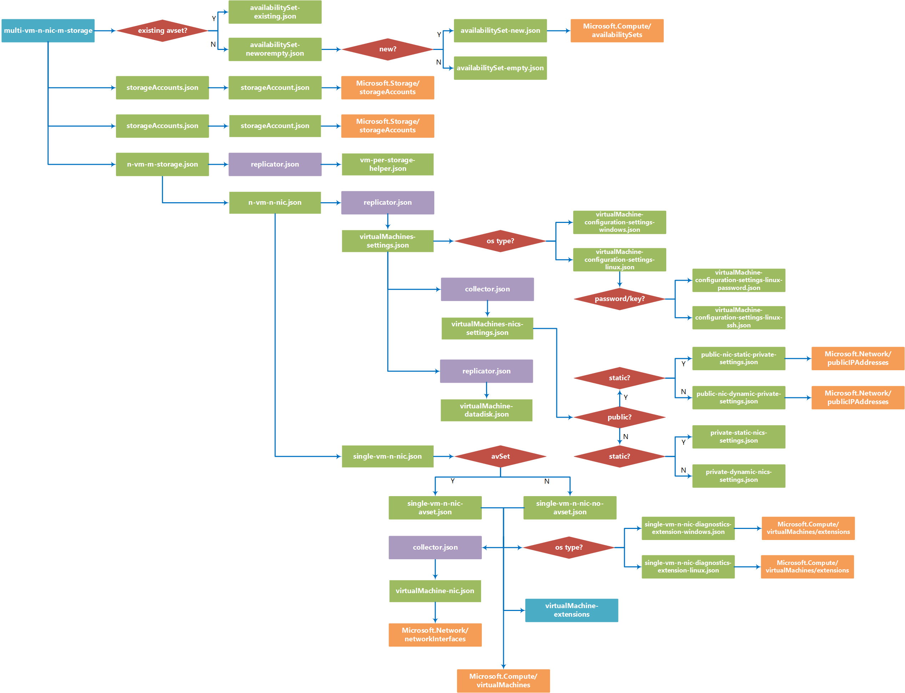

# multi-vm-n-nic-m-storage

You can use the multi-vm-n-nic-m-storage template building block to create one or more [virtual machines (VMs)](https://azure.microsoft.com/en-us/documentation/services/virtual-machines/) and deploy them to an [Azure virtual network (VNet)](https://azure.microsoft.com/en-us/documentation/articles/virtual-networks-overview/). If you don't have a VNet set up, you can use the [vnet-n-subnet](https://github.com/mspnp/template-building-blocks/tree/master/scenarios/vnet-n-subnet) building block to create one.

In addition to defining the OS and Storage configuration of newly created VMs, this block allows you to create multiple [network interfaces (NICs)](https://azure.microsoft.com/en-us/documentation/articles/resource-groups-networking/#nic) and configure [VM extensions](https://azure.microsoft.com/en-us/documentation/articles/virtual-machines-windows-extensions-features/) for your VMs. It also allows you to create a new availability set for you machines, or use an existing one.

## Parameters

You need to specify three parameters in this building block, named **virtualMachinesSettings**, **virtualNetworkSettings**, and **buildingBlockSettings**. 

### virtualMachinesSettings
The virtualMachinesSettings parameter contains the configuration settings the block will use when creating your VMs. It contains the following properties:

- **namePrefix**  
  Required. The namePrefix property is used to generate individual Azure VM names (note this is the Azure display name for the VM, not its OS host name). For instance, if your namePrefix is **test-machines** and you're creating 3 VMs, your Azure VM names will be **test-machines-vm1**, **test-machines-vm2**, and **test-machines-vm**.   
  ```json
  "namePrefix": "bb-dev"
  ```
- **computerNamePrefix**  
  Required. The computerNamePrefix property is used to generate individual host names for the VM's OS. For instance, if your computerNamePrefix is **host-machines*, and you're creating 3 VMs, your VM host names will be **host-machines-vm1**, **host-machines-vm2**, and **host-machines-vm3**. 
  ```json
  "computerNamePrefix": "bb-dev"
  ```
- **size**  
  Required. Size of the VMs to create. Note that this block uses [premium storage](https://azure.microsoft.com/en-us/documentation/articles/storage-premium-storage/), and only supports VM sizes that make use of premium storage. See [Sizes for virtual machines in Azure](https://azure.microsoft.com/en-us/documentation/articles/virtual-machines-windows-sizes/) for more information.
  ```json
  "size": "Standard_DS4_v2"
  ```
- **osType**  
  Required. Type of operating system that will be installed ("linux" or "windows").
  ```json
  "osType": "windows"
  ```
- **adminUsername**  
  Required. Administrator user name for logging into the VM's OS. 
  ```json
  "adminUsername": "testuser"
  ```
- **adminPassword**  
	Optional. Administrator user name for logging into the VM's OS. (Required if osAuthenticationType = "password") 
  ```json
  "adminPassword": "AweS0me@PW"
  ```
- **sshPublicKey**  
  Optional. SSH key used to log into the VM OS's Administrator account. (Required if osAuthenticationType = "ssh")
  ```json
  "sshPublicKey": "ssh-rsa AAAAB3NzaC1yc2EAAAABJQAAAIEA0v5ZQ0BlLcbhYVvysYaHI4ELVLHRopH/K1u7fuqa+iN6mP/vem3AXwwkXTGcBrnjNx7ZWmP5IIqfx6LlNiBrQZQRKucoJ4q3B3X1uXMTUtTbnniK7fSBtAnqKhWi+tCK+k+BhdsPhEpBdHy/d+Xwr3nxZDVHTpPhxRKFOhboMos= rsa-key-20160908"
  ```
- **osAuthenticationType**  
  Required. Login authentication type. ("password" or "ssh") 
  ```json
  "osAuthenticationType": "password"
  ```
  **Note** SSH authentication is only supported on Linux VMs.  

- **nics**  
  Required. The nics property contains an array of one or more network interface settings. Each interface definition contains the following properties:
  - **isPublic** - Required. Is this NIC accessible from outside it's VNet.  ("true" / "false")
  - **subnetName** - Required. Subnet the NIC is connected to.
  - **privateIPAllocationMethod** - Required. How is IP address assigned on private network? ("Static" / "Dynamic")
  - **publicIPAllocationMethod** - Optional. How is IP address assigned on private network?  ("Static" / "Dynamic")
  - **startingIPAddress** - Optional. If private IP is static, this is the IP assigned to this NIC on the first VM created. Additional VMs will increment this address by one.  
  - **enableIPForwarding** - Required. Enable IP forwarding for this NIC? (true / false) 
  - **dnsServers** - Required. Defines one or more custom DNS Server addresses of the NIC. Leave blank to use Azure internal name resolution. 
      ```json 
      "dnsServers": [ ] 
      ``` 
  - **isPrimary** - Required. Is this the primary NIC for VM? ("true"/"false")
  ```json
  "nics": [
    {
      "isPublic": "true",
      "subnetName": "web",
      "privateIPAllocationMethod": "Static",
      "publicIPAllocationMethod": "Dynamic",
      "startingIPAddress": "10.0.0.240",
      "enableIPForwarding": true,
      "dnsServers": [ ],
      "isPrimary": "true"
    },
    {
      "isPublic": "false",
      "subnetName": "biz",
      "privateIPAllocationMethod": "Dynamic",
      "enableIPForwarding": false,
      "dnsServers": ["10.0.0.220","10.0.1.233"],
      "isPrimary": "false"
    }
  ]
  ```
- **imageReference**  
Required. The imageReference property defines the operating system installed on the VMs you're creating. it contains the following properties:
  - **publisher** - Required. OS publisher
  - **offer** - Required. OS Offering 
  - **sku** - Required. OS Product SKU 
  - **version** - Required. OS Version (specific version number or "latest")
  ```json
  "imageReference": {
    "publisher": "MicrosoftWindowsServer",
    "offer": "WindowsServer",
    "sku": "2012-R2-Datacenter",
    "version": "latest"
  }
  ```

- **dataDisks**
Required. The dataDisks property allows you to specify the number, size, and properties of any data disks you want created for your virtual machines. it contains the following properties:
  - **count** - Required. Number of data disks to create.
  - **properties** -  Required. Object that defines the details about the data disk. Contains:
    - **diskSizeGB** - Required. Disk size in GB.
    - **Caching** - Required. Disk caching setting. The options are "Read" (write through caching) and "ReadWrite" (write back caching), and "None".
    - **createOption** - Required. Type of disk to create. Currently only "Empty" disks are supported.
  ```json
  "dataDisks": {
    "count": 2,
    "properties": {
      "diskSizeGB": 127,
      "caching": "None",
      "createOption": "Empty"
    }
  }
  ```
  **Note** Data disks are optional, but the dataDisks property is required. If not using data disks, set the **count** properties to 0 and leave the **properties** property blank, as shown below. 
  ```json
  "dataDisks": {
    "count": 0,
    "properties": { }
  }
  ```


- **osDisk**  
Required. The osDisk property is an object allowing you to specify the caching setting of the OS drive via a **caching** sub-property. The options are "Read" (write through caching) and "ReadWrite" (write back caching).
  ```json
    "osDisk": {
      "caching": "ReadWrite"
    }
  ```
- **extensions**  
Required. The extensions property is an array of one or more extension definition objects, which allows you to specify any [VM Extensions](https://github.com/Azure/azure-content/blob/master/includes/virtual-machines-common-extensions-features.md) you want loaded on your new VMs.  

  For details about configuring, see the [virtualMachine-extensions template building block]() which uses the same **extensions** property structure.

<!-- commented out to confirm linkout is desired behavior
Each defintion contains the following properties:
  - **name** - Required. Defines the display name of this extension. 
  - **publisher** - Required. Extension publisher name. 
  - **type** - Required. Extension type.
  - **typeHandlerVersion** - Required. Extensions version to use.
  - **autoUpgradeMinorVersion** - Required. Sets if the extension is allowed to upgrade automatically. (true / false) 
  - **settingsConfigMapperUri** - URL of template used during the depoyment process. Should always be "https://raw.githubusercontent.com/mspnp/template-building-blocks/master/templates/resources/Microsoft.Compute/virtualMachines/extensions/vm-extension-passthrough-settings-mapper.json"  
  - **settingsConfig** - Required. Object containing extension specific settings. Can be empty.   
  - **protectedSettingsConfig** - Required. Object containing extension specific settings that need to be encrypted. Can be empty.
  ```json
  "extensions": [
    {
      "name": "IaaSAntimalware",
      "publisher": "Microsoft.Azure.Security",
      "type": "IaaSAntimalware",
      "typeHandlerVersion": "1.3",
      "autoUpgradeMinorVersion": true,
      "settingsConfigMapperUri": "https://raw.githubusercontent.com/mspnp/template-building-blocks/master/templates/resources/Microsoft.Compute/virtualMachines/extensions/vm-extension-passthrough-settings-mapper.json",
      "settingsConfig": {
        "AntimalwareEnabled": true,
        "RealtimeProtectionEnabled": "false",
        "ScheduledScanSettings": {
          "isEnabled": "false",
          "day": "7",
          "time": "120",
          "scanType": "Quick"
        },
        "Exclusions": {
          "Extensions": ".gif",
          "Paths": "c:\\test",
          "Processes": "test.exe"
        }
      },
      "protectedSettingsConfig": { }
    },
    {
      "name": "malware",
      "publisher": "Symantec",
      "type": "SymantecEndpointProtection",
      "typeHandlerVersion": "12.1",
      "autoUpgradeMinorVersion": true,
      "settingsConfigMapperUri": "https://raw.githubusercontent.com/mspnp/template-building-blocks/master/templates/resources/Microsoft.Compute/virtualMachines/extensions/vm-extension-passthrough-settings-mapper.json",
      "settingsConfig": {
      },
      "protectedSettingsConfig": { }
    }
  ]
  ```
  -->
- **availabilitySet**  
Required. The availabilitySet property sets the availability set your new VMs will be included in. It contains two properties:
  - **name** - Required. Availabilty set name.
  - **useExistingAvailabilitySet** - Required. Does the availability set exist already? If "Yes", then the new VMs get added to it. if "No", then a new availability set will be created.
  ```json
  "availabilitySet": {
    "useExistingAvailabilitySet": "No",
    "name": "bb-dev-as"
  }
  ```
### virtualNetworkSettings
The virtualNetworkSettings parameter is an object that specifies the VNet that your VMs will connect to, and the resource group where that VNet exists. It contains the following properties:

- **name**  
   Required. Name of an existing VNet which contains the subnets your VMs will be communicating. 
	```json
	"name": "bb-dev-vnet"
	```

- **resourceGroup**  
Required. Azure Resource Group the VM will be created in.  
  ```json
  "resourceGroup": "bb-dev-rg"
  ```
**Note** Although the block uses these VNet settings to connect NICs to specific subnets, the VMs themselves will be created in whatever resource group you specify when executing the deployment template.  

### buildingBlockSettings
The buildingBlockSettings parameter provides the basic settings for how many VMs and storage accounts you want to create.
- **storageAccountsCount**  
Required. Number of storage accounts to create.
  ```json
  "storageAccountsCount": 2
  ```
- **vmCount**  
Required. Number of VMs to create.
  ```json
  "vmCount": 2
  ```
- **vmStartIndex**  
 Required. Starting point for numbering VMs.
  ```json
  "vmStartIndex": 1
  ```
**Note** if there are fewer storage accounts created than VMs, the building block distributes the VMs across the storage accounts as evenly as possible. For example, if you create 2 storage accounts, and 6 VMs, 3 VMs will be deployed to each storage account. 

## Example parameters file

The following parameters file creates two VMs named **bb-dev-vm1** and **bb-dev-vm2**, each living on separate storage accounts and attached to a newly created **bb-dev-as** availability set. These machines are configured to run Windows 2012 R2 Datacenter edition, and connected to a VNet named **bb-dev-vnet**, with one NIC connected to the **web** subnet and another to the **data** subnet. Each VM is created with a standard OS drive as well as two 127GB data drives. In addition, the IaasMalware and Symantec security extensions are added and configured on each machine. 

```json
{
  "$schema": "http://schema.management.azure.com/schemas/2015-01-01/deploymentParameters.json#",
  "contentVersion": "1.0.0.0",
  "parameters": {
    "virtualMachinesSettings": {
      "value": {
        "namePrefix": "bb-dev",
        "computerNamePrefix": "bb-dev",
        "size": "Standard_DS4_v2",
        "osType": "windows",
        "adminUsername": "testuser",
        "adminPassword": "AweS0me@PW",
        "osAuthenticationType": "password",
        "nics": [
          {
            "isPublic": "true",
            "subnetName": "web",
            "privateIPAllocationMethod": "Static",
            "publicIPAllocationMethod": "Dynamic",
            "startingIPAddress": "10.0.0.240",
            "enableIPForwarding": true,
            "dnsServers": [
            ],
            "isPrimary": "true"
          },
          {
            "isPublic": "false",
            "subnetName": "biz",
            "privateIPAllocationMethod": "Dynamic",
            "enableIPForwarding": false,
            "dnsServers": [
            ],
            "isPrimary": "false"
          },
          {
            "isPublic": "false",
            "subnetName": "data",
            "privateIPAllocationMethod": "Static",
            "startingIPAddress": "10.0.2.240",
            "enableIPForwarding": false,
            "dnsServers": [
            ],
            "isPrimary": "false"
          }
        ],
        "imageReference": {
          "publisher": "MicrosoftWindowsServer",
          "offer": "WindowsServer",
          "sku": "2012-R2-Datacenter",
          "version": "latest"
        },
        "dataDisks": {
          "count": 2,
          "properties": {
            "diskSizeGB": 127,
            "caching": "None",
            "createOption": "Empty"
          }
        },
        "osDisk": {
          "caching": "ReadWrite"
        },
        "extensions": [
          {
            "name": "IaaSAntimalware",
            "publisher": "Microsoft.Azure.Security",
            "type": "IaaSAntimalware",
            "typeHandlerVersion": "1.3",
            "autoUpgradeMinorVersion": true,
            "settingsConfigMapperUri": "https://raw.githubusercontent.com/mspnp/template-building-blocks/master/templates/resources/Microsoft.Compute/virtualMachines/extensions/vm-extension-passthrough-settings-mapper.json",
            "settingsConfig": {
              "AntimalwareEnabled": true,
              "RealtimeProtectionEnabled": "false",
              "ScheduledScanSettings": {
                "isEnabled": "false",
                "day": "7",
                "time": "120",
                "scanType": "Quick"
              },
              "Exclusions": {
                "Extensions": ".gif",
                "Paths": "c:\\test",
                "Processes": "test.exe"
              }
            },
            "protectedSettingsConfig": { }
          },
          {
            "name": "malware",
            "publisher": "Symantec",
            "type": "SymantecEndpointProtection",
            "typeHandlerVersion": "12.1",
            "autoUpgradeMinorVersion": true,
            "settingsConfigMapperUri": "https://raw.githubusercontent.com/mspnp/template-building-blocks/master/templates/resources/Microsoft.Compute/virtualMachines/extensions/vm-extension-passthrough-settings-mapper.json",
            "settingsConfig": {
            },
            "protectedSettingsConfig": { }
          }

        ],
        "availabilitySet": {
          "useExistingAvailabilitySet": "No",
          "name": "bb-dev-as"
        }
      }
    },
    "virtualNetworkSettings": {
      "value": {
        "name": "bb-dev-vnet",
        "resourceGroup": "bb-dev-rg"
      }
    },
    "buildingBlockSettings": {
      "value": {
        "storageAccountsCount": 2,
        "vmCount": 2,
        "vmStartIndex": 1
      }
    }
  }
}


```

<!-- Image goes here-->

## Deployment

You can deploy a building block by using the Azure portal, PowerShell, or Azure CLI. The examples below show how to deploy the building block using the sample parameters file above.

### Azure portal

Note that the building block deployment process will require you store your parameters file in a location with a publicly available URI, which you provide during deployment.

[](https://portal.azure.com/#create/Microsoft.Template/uri/https%3A%2F%2Fraw.githubusercontent.com%2Fmspnp%2Ftemplate-building-blocks%2Fmaster%2Fscenarios%2Fmulti-vm-n-nic-m-storage%2Fazuredeploy.json)  

1. Click the above deployment button, the Azure portal will be opened.
1. In the deployment's **TEMPLATEPARAMETERURI** parameter, specify the public URI where your parameters file is located. 
2. Specify or create the Resource Group where you want the VNet deployed to.
3. Click the **Create** button.

### PowerShell

You can use the **New-AzureRmResourceGroupDeployment** to deploy the building block template using a parameter file located at a publicly available URI.

1. Upload a parameters file to a location with a publicly available URI.
2. Run the **New-AzureRmResourceGroupDeployment** cmdlet as shown below.
```PowerShell
New-AzureRmResourceGroupDeployment -ResourceGroupName <Resource Group Name>
  -TemplateUri https://raw.githubusercontent.com/mspnp/template-building-blocks/master/scenarios/multi-vm-n-nic-m-storage/azuredeploy.json 
  -templateParameterUriFromTemplate <URI of parameters file>
```

**Example**  
The cmdlet below deploys a multi-vm-n-nic-m-storage building block to the **app1-rg** resource group using a parameter file hosted in Azure blob storage.

```PowerShell
New-AzureRmResourceGroupDeployment -ResourceGroupName app1-rg -TemplateUri https://raw.githubusercontent.com/mspnp/template-building-blocks/master/scenarios/multi-vm-n-nic-m-storage/azuredeploy.json   -templateParameterUriFromTemplate http://buildingblocksample.blob.core.windows.net/building-block-params/vms.parameters.json
```

### Azure CLI

To deploy the building block using a parameters file available from a URI:

1. Upload a parameters file to a location with a publicly available URL.
2. Run the command shown below to deploy the VNet
```AzureCLI
azure config mode arm
azure group deployment create <Resource Group Name>
  --template-uri https://raw.githubusercontent.com/mspnp/template-building-blocks/master/scenarios/multi-vm-n-nic-m-storage/azuredeploy.json 
  -p "{\"templateParameterUri\":{\"value\":\"<Parameters File Public URI>\"}}"
```

**Example**  
The command below deploys a multi-vm-n-nic-m-storage building block to the **app1-rg** resource group using a parameter file hosted in Azure blob storage.

```AzureCLI
azure config mode arm
azure group deployment create app1-rg --template-uri https://raw.githubusercontent.com/mspnp/template-building-blocks/master/scenarios/multi-vm-n-nic-m-storage/azuredeploy.json -p "{\"templateParameterUri\":{\"value\":\"http://buildingblocksample.blob.core.windows.net/building-block-params/vms.parameters.json\"}}"
```

## Extending the building block

You can extend existing building blocks, and create your own building blocks. Each building block is created using a set of templates. The flowchart below represents the different templates used to create the VMs building block.


