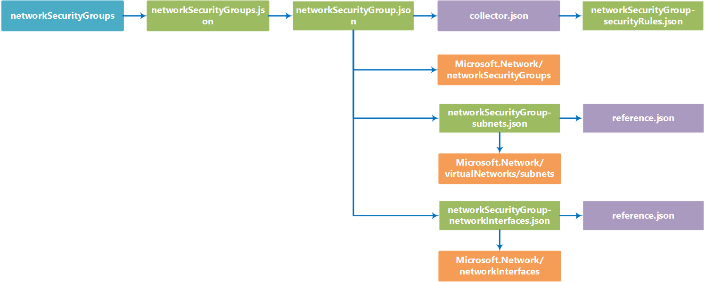

# networkSecurityGroups

You can use the networkSecurityGroups template building block to create one or more [Network Security Groups (NSG)](https://azure.microsoft.com/en-us/documentation/articles/virtual-networks-nsg/) and associate it to a subnet on an existing [Azure virtual network (VNet)](https://azure.microsoft.com/en-us/documentation/articles/virtual-networks-overview/). 

The default NSG rules enable full incoming and outgoing access within the VNet. For communication with the outside Internet, all inbound traffic is blocked. Any access from the outside (including common services like RDP) needs to be explicitly allowed in the NSG security rules.

NSGs must be associated with at least one subnet on your VNet. You can also apply NSGs to specific Network Interfaces (NICs) within a subnet, although this is optional.

Unlike in the Network Resource Provider, creating and modifying NSGs is handled independently. As a result, you'll need a pre-existing VNet, along with any subnets you need to associate NSGs with. If you don't have a VNet set up, you can use the [vnet-n-subnet](https://github.com/mspnp/template-building-blocks/tree/master/scenarios/vnet-n-subnet) building block to create one.

**Note** We chose to have separate building block for NSGs so that these can be applied individually, without redefining the entire virtual network. Most deployments use extensions that require access to the Internet during deployment. By separating these blocks, you can deploy the VNet and your VMs, and then tighten security with NSGs.

## Parameters

You need to specify two parameters in this building block, named **virtualNetworkSettings** and **networkSecurityGroupsSettings**. 

### virtualNetworkSettings
The virtualNetworkSettings parameter is an object that specifies the VNet and resource group associated with your new NSG. It contains the following properties:

- **name**  
   Required. Name of the VNet that these NSGs apply to.   
	```json
	"name": "bb-dev-vnet"
	```

- **resourceGroup**  
Required. Azure Resource Group the NSG belongs to.  
  ```json
  "resourceGroup": "bb-dev-rg"
  ```

### networkSecurityGroupsSettings
The networkSecurityGroupsSettings parameter contains an array of one or more NSG setting object, which define security rules and the associated subnets and NICs those rules apply to. Each NSG definition contains the following properties:

- **name**  
  Required. Name of the NSG.  
  ```json
  "name": "bb-dev-web-nsg"
  ```  
- **subnets**  
  Required. An array of one or more subnet names that this NSG applies.
  ```json
  "subnets": ["web","biz"]
  ``` 
- **networkInterfaces**  
Required. An array containing the names of one or more virtual network interface cards (NICs). This allows you to restrict the security group rules to specific NICs. 
  ```json
  "networkInterfaces": ["bb-dev-web1-nic1","bb-dev-web2-nic1"]
  ```
  **Note** Leave the **networkInterfaces** property blank, as shown below, to apply the NSG rules to all NICs on the subnet. 
  ```json 
  "networkInterfaces": [ ] 
  ```

- **securityRules**  
Required. The securityRules property contains an array of one or more security rules. Each rule contains the following properties:
  - **name** - Required. Name of the rule.  
  - **direction** - Required. Direction of traffic to match for the rule.   
Allowable value: Inbound or Outbound 
  - **priority** - Required. Rules are checked in the order of priority, once a rule applies, no more rules are tested for matching.  
  Allowable value: Number between 100 and 4096 
  - **sourceAddressPrefix** - Required. Source address prefix or tag to match for the rule.  
  Allowable values: Single IP address (i.e. 10.10.10.10), CIDR Block (i.e. 192.168.1.0/24), default tag (VIRTUAL_NETWORK, AZURE_LOADBALANCER, or INTERNET), or * (for all addresses) 
  - **destinationAddressPrefix** - Required. Destination address prefix or tag to match for the rule.  
  Allowable values: Single IP address (i.e. 10.10.10.10), CIDR Block (i.e. 192.168.1.0/24), default tag (VIRTUAL_NETWORK, AZURE_LOADBALANCER, or INTERNET), or * (for all addresses) 
  - **sourcePortRange** - Required. Source port range to match for the rule.  
  Allowable values: Single port number from 1 to 65535, port range (i.e. 1-65635), or * (for all ports) 
  - **destinationPortRange** - Required. Destination port range to match for the rule.   
Allowable values: Single port number from 1 to 65535, port range (i.e. 1-65535), or * (for all ports) 
  - **access** - Required. Type of access to apply if the rule matches.   
Allowable values: Allow or Deny
  - **protocol** -  Required. Protocol to match for the rule.   
Allowable values: TCP, UDP, or * (for all protocols) 

  ```json
  "securityRules": [
  {
      "name": "HTTPAllow",
      "direction": "Inbound",
      "priority": 200,
      "sourceAddressPrefix": "*",
      "destinationAddressPrefix": "*",
      "sourcePortRange": "*",
      "destinationPortRange": "80",
      "access": "Allow",
      "protocol": "Tcp"
  },
    {
      "name": "SQLAllow",
      "direction": "Inbound",
      "priority": 200,
      "sourceAddressPrefix": "VIRTUAL_NETWORK",
      "destinationAddressPrefix": "*",
      "sourcePortRange": "*",
      "destinationPortRange": "1433",
      "access": "Allow",
      "protocol": "Tcp"
    }
  ]
  ```            


## Example parameters file


The following parameters file will create two NSGs for a VNet named **bb-dev-vnet**. The first is applied to subnets named **web** and **biz** and allows incoming access to RDP and HTTP requests. The second NSG applies to the **data** subnet, and allows incoming access to the RDP and SQL services.

```json
{
  "$schema": "http://schema.management.azure.com/schemas/2015-01-01/deploymentParameters.json#",
  "contentVersion": "1.0.0.0",
  "parameters": {
    "virtualNetworkSettings": {
      "value": {
        "name": "bb-dev-vnet",
        "resourceGroup": "bb-dev-rg"
      }
    },
    "networkSecurityGroupsSettings": {
      "value": [
        {
          "name": "bb-dev-web-nsg",
          "subnets": [
            "web",
            "biz"
          ],
          "networkInterfaces": [ ],
          "securityRules": [
            {
              "name": "RDPAllow",
              "direction": "Inbound",
              "priority": 100,
              "sourceAddressPrefix": "10.0.0.128/25",
              "destinationAddressPrefix": "*",
              "sourcePortRange": "*",
              "destinationPortRange": "3389",
              "access": "Allow",
              "protocol": "Tcp"
            },
            {
              "name": "HTTPAllow",
              "direction": "Inbound",
              "priority": 200,
              "sourceAddressPrefix": "*",
              "destinationAddressPrefix": "*",
              "sourcePortRange": "*",
              "destinationPortRange": "80",
              "access": "Allow",
              "protocol": "Tcp"
            }
          ]
        },
        {
          "name": "bb-dev-data-nsg",
          "subnets": [
            "data"
          ],
          "networkInterfaces": [ ],
          "securityRules": [
            {
              "name": "RDPAllow",
              "direction": "Inbound",
              "priority": 100,
              "sourceAddressPrefix": "10.0.0.128/25",
              "destinationAddressPrefix": "*",
              "sourcePortRange": "*",
              "destinationPortRange": "3389",
              "access": "Allow",
              "protocol": "Tcp"
            },
            {
              "name": "SQLAllow",
              "direction": "Inbound",
              "priority": 200,
              "sourceAddressPrefix": "*",
              "destinationAddressPrefix": "*",
              "sourcePortRange": "*",
              "destinationPortRange": "1433",
              "access": "Allow",
              "protocol": "Tcp"
            }
          ]
        }
      ]
    }
  }
}


```
<!-- Image goes here -->


## Deployment

You can deploy a building block by using the Azure portal, PowerShell, or Azure CLI. The examples below show how to deploy the building block using the sample parameters file above.

### Azure portal

Note that the building block deployment process will require you store your parameters file in a location with a publicly available URI, which you provide during deployment.

[](https://portal.azure.com/#create/Microsoft.Template/uri/https%3A%2F%2Fraw.githubusercontent.com%2Fmspnp%2Ftemplate-building-blocks%2Fmaster%2Fscenarios%2FnetworkSecurityGroups%2Fazuredeploy.json)  

1. Click the above deployment button, the Azure portal will be opened.
1. In the deployment's **TEMPLATEPARAMETERURI** parameter, specify the public URI where your parameters file is located. 
2. Specify or create the Resource Group where you want the VNet deployed to.
3. Click the **Create** button.

### PowerShell

You can use the **New-AzureRmResourceGroupDeployment** to deploy the building block template using a parameter file located at a publicly available URI.

1. Upload a parameters file to a location with a publicly available URI.
2. Run the **New-AzureRmResourceGroupDeployment** cmdlet as shown below.
```PowerShell
New-AzureRmResourceGroupDeployment -ResourceGroupName <Resource Group Name>
  -TemplateUri https://raw.githubusercontent.com/mspnp/template-building-blocks/master/scenarios/networkSecurityGroups/azuredeploy.json 
  -templateParameterUriFromTemplate <URI of parameters file>
```

**Example**  
The cmdlet below deploys a networkSecurityGroups building block to the **app1-rg** resource group using a parameter file hosted in Azure blob storage.

```PowerShell
New-AzureRmResourceGroupDeployment -ResourceGroupName app1-rg -TemplateUri https://raw.githubusercontent.com/mspnp/template-building-blocks/master/scenarios/networkSecurityGroups/azuredeploy.json -templateParameterUriFromTemplate http://buildingblocksample.blob.core.windows.net/building-block-params/nsg.parameters.json
```

### Azure CLI

To deploy the building block using a parameters file available from a URI:

1. Upload a parameters file to a location with a publicly available URL.
2. Run the command shown below to deploy the VNet
```AzureCLI
azure config mode arm
azure group deployment create <Resource Group Name>
  --template-uri https://raw.githubusercontent.com/mspnp/template-building-blocks/master/scenarios/networkSecurityGroups/azuredeploy.json 
  -p "{\"templateParameterUri\":{\"value\":\"<parameters File Public URI>\"}}"
```

**Example**  
The command below deploys a networkSecurityGroups building block to the **app1-rg** resource group using a parameter file hosted in Azure blob storage.

```AzureCLI
azure config mode arm
azure group deployment create app1-rg --template-uri https://raw.githubusercontent.com/mspnp/template-building-blocks/master/scenarios/networkSecurityGroups/azuredeploy.json -p "{\"templateParameterUri\":{\"value\":\"http://buildingblocksample.blob.core.windows.net/building-block-params/nsg.parameters.json\"}}"
```

## Extending the building block

You can extend existing building blocks, and create your own building blocks. Each building block is created using a set of templates. The flowchart below represents the different templates used to create the NSG building block.

