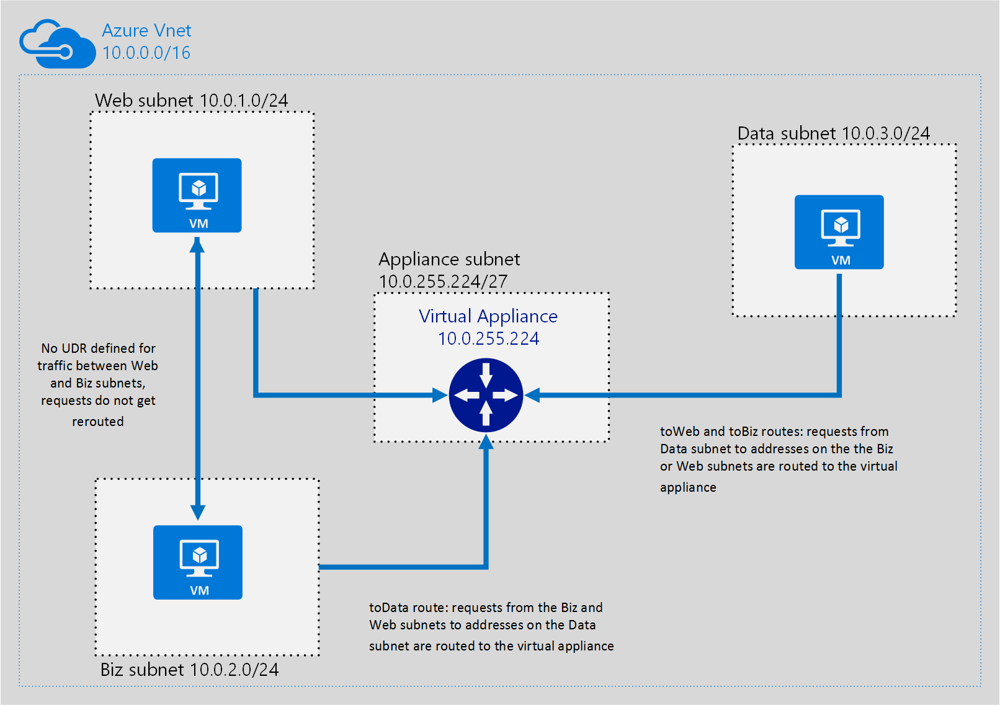
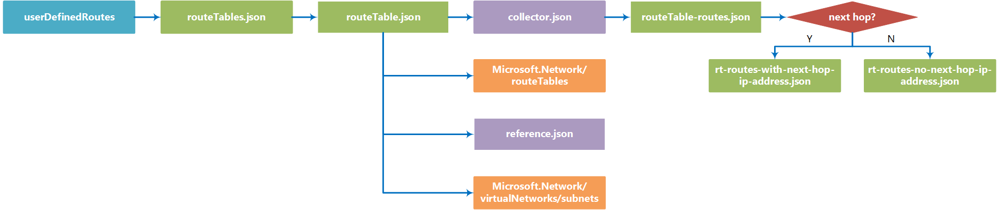

# userDefinedRoutes

You can use the userDefinedRoutes template building block to deploy one or more [User Defined Routes (UDRs)](https://azure.microsoft.com/en-us/documentation/articles/virtual-networks-udr-overview/) to an [Azure virtual network (VNet)](https://azure.microsoft.com/en-us/documentation/articles/virtual-networks-overview/). 

Unlike in the Network Resource Provider, creating and modifying UDRs using this block is handled independently of creating your virtual network. As a result, this building block requires a pre-existing VNet and resource group. If you don't have a VNet set up, you can use the [vnet-n-subnet](https://github.com/mspnp/template-building-blocks/tree/master/scenarios/vnet-n-subnet) building block to create one.

**Note** We chose to have separate building block for UDRs so that these can be applied individually, without redefining the entire virtual network. Most deployments use extensions that require access to the Internet during deployment. By separating these blocks, you can deploy the VNet and your VMs, and then tighten security with UDRs.

## Parameters

You need to specify two parameters in this building block, named **virtualNetworkSettings** and **routeTableSettings**. 

### virtualNetworkSettings
The virtualNetworkSettings parameter is an object that specifies the VNet and resource group associated with your new UDRs. It contains the following properties:

- **name**  
   Required. Name of the VNet that these UDRs apply to.     
	```json
	"name": "bb-dev-vnet"
	```

- **resourceGroup**  
Required. Azure Resource Group the UDR belongs to.
  ```json
  "resourceGroup": "bb-dev-rg"
  ```

### routeTableSettings
The routeTableSettings parameter contains an array of one or more route table setting objects, which define the specific routes and the subnets and IP ranges routes apply to. Each route table setting contains the following properties:

- **name**  
   Required. Name of the route.  
	```json
	"name": "bb-dev-data-rt"
	```
- **subnets**  
Required. An array of subnet names that these route table settings apply to.  
  ```json
  "subnets": ["web","biz"]
  ``` 
- **routes**  
  Required. The routes property contains an array of one or more route definitions. Each route definition contains the following properties:
  - **name** - Required. Name of the route.  
  - **addressPrefix** - Required. The destination CIDR block to which the route applies, such as 10.1.0.0/16.
  - **nextHopType** - Required. The type of Azure hop the packet should be sent to.  
  Allowable values: VirtualNetwork, VirtualNetworkGateway, Internet, VirtualAppliance, None
  - **nextHopIpAddress** - Optional. The next hop address contains the IP address packets should be forwarded to. Next hop values are only allowed in routes where the next hop type is Virtual Appliance.
  ```json
  "routes": [
    {
      "name": "toWeb",
      "addressPrefix": "10.0.0.0/24",
      "nextHopType": "VirtualAppliance",
      "nextHopIpAddress": "10.0.255.224"
    },
    {
      "name": "toBiz",
      "addressPrefix": "10.0.1.0/24",
      "nextHopType": "VirtualAppliance",
      "nextHopIpAddress": "10.0.255.224"
    }]

 
  ``` 

## Example parameters file


The following parameters file assumes a VNet named **bb-dev-vnet** which contains 4 subnets (**web**, **biz**, **data**, and **appliance**). It creates the UDR rules to route all traffic between the **data** subnet and the **web** and **biz** subnets to a virtual appliance living in the appliance subnet:

```json
{
    "$schema": "http://schema.management.azure.com/schemas/2015-01-01/deploymentParameters.json#",
    "contentVersion": "1.0.0.0",
  "parameters": {
    "virtualNetworkSettings": {
      "value": {
        "name": "bb-dev-vnet",
        "resourceGroup": "bb-dev-rg"
      }
    },
    "routeTableSettings": {
      "value": [
        {
          "name": "bb-dev-web-biz-rt",
          "subnets": [
            "web",
            "biz"
          ],
          "routes": [
            {
              "name": "toData",
              "addressPrefix": "10.0.3.0/24",
              "nextHopType": "VirtualAppliance",
              "nextHopIpAddress": "10.0.255.224"
            }
          ]
        },
        {
          "name": "bb-dev-data-rt",
          "subnets": [
            "data"
          ],
          "routes": [
            {
              "name": "toWeb",
              "addressPrefix": "10.0.1.0/24",
              "nextHopType": "VirtualAppliance",
              "nextHopIpAddress": "10.0.255.224"
            },
            {
              "name": "toBiz",
              "addressPrefix": "10.0.2.0/24",
              "nextHopType": "VirtualAppliance",
              "nextHopIpAddress": "10.0.255.224"
            }
          ]
        }
      ]
    }
  }
}
```
These parameters will create a routing table which redirects any requests from the **web** and **biz** subnets to IP addresses in the **data** subnet, and any requests from the **data** subnet to IP addresses in the **web** or **biz** subnets, to a virtual appliance:




## Deployment

You can deploy a building block by using the Azure portal, PowerShell, or Azure CLI. The examples below show how to deploy the building block using the sample parameters file above.

### Azure portal

Note that the building block deployment process will require you store your parameters file in a location with a publicly available URI, which you provide during deployment.

[](https://portal.azure.com/#create/Microsoft.Template/uri/https%3A%2F%2Fraw.githubusercontent.com%2Fmspnp%2Ftemplate-building-blocks%2Fmaster%2Fscenarios%2FuserDefinedRoutes%2Fazuredeploy.json)  

1. Click the above deployment button, the Azure portal will be opened.
1. In the deployment's **TEMPLATEPARAMETERURI** parameter, specify the public URI where your parameters file is located. 
2. Specify or create the Resource Group where you want the VNet deployed to.
3. Click the **Create** button.

### PowerShell

You can use the **New-AzureRmResourceGroupDeployment** to deploy the building block template using a parameter file located at a publicly available URI.

1. Upload a parameters file to a location with a publicly available URI.
2. Run the **New-AzureRmResourceGroupDeployment** cmdlet as shown below.
```PowerShell
New-AzureRmResourceGroupDeployment -ResourceGroupName <Resource Group Name>
  -TemplateUri https://raw.githubusercontent.com/mspnp/template-building-blocks/master/scenarios/userDefinedRoutes/azuredeploy.json 
  -templateParameterUriFromTemplate <URI of parameters file>
```

**Example**  
The cmdlet below deploys a userDefinedRoutes building block to the **app1-rg** resource group using a parameter file hosted in Azure blob storage.

```PowerShell
New-AzureRmResourceGroupDeployment -ResourceGroupName app1-rg -TemplateUri https://raw.githubusercontent.com/mspnp/template-building-blocks/master/scenarios/userDefinedRoutes/azuredeploy.json -templateParameterUriFromTemplate http://buildingblocksample.blob.core.windows.net/building-block-params/udr.parameters.json
```

### Azure CLI

To deploy the building block using a parameters file available from a URI:

1. Upload a parameters file to a location with a publicly available URL.
2. Run the command shown below to deploy the VNet
```AzureCLI
azure config mode arm
azure group deployment create <Resource Group Name>
  --template-uri https://raw.githubusercontent.com/mspnp/template-building-blocks/master/scenarios/userDefinedRoutes/azuredeploy.json 
  -p "{\"templateParameterUri\":{\"value\":\"<parameters File Public URI>\"}}"
```

**Example**  
The command below deploys a userDefinedRoutes building block to the **app1-rg** resource group using a parameter file hosted in Azure blob storage.

```AzureCLI
azure config mode arm
azure group deployment create app1-rg --template-uri https://raw.githubusercontent.com/mspnp/template-building-blocks/master/scenarios/userDefinedRoutes/azuredeploy.json -p "{\"templateParameterUri\":{\"value\":\"http://buildingblocksample.blob.core.windows.net/building-block-params/udr.parameters.json\"}}"
```

## Extending the building block

You can extend existing building blocks, and create your own building blocks. Each building block is created using a set of templates. The flowchart below represents the different templates used to create the UDR building block.

