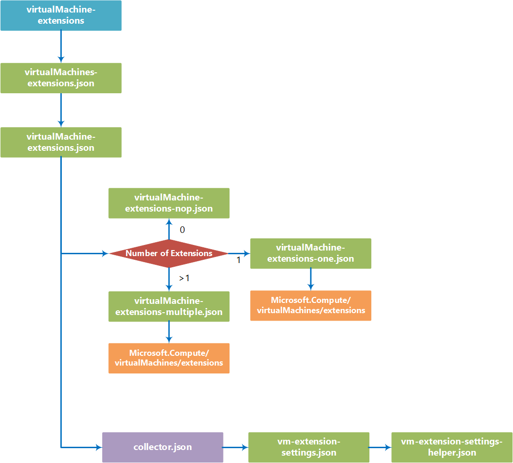

# virtualMachine-extensions

You can use the virtualMachine-extensions template building block to deploy one or more [virtual machine extensions](https://azure.microsoft.com/en-us/documentation/articles/virtual-machines-windows-extensions-features/) to an Azure virtual machine.

Extensions can also be configured when creating VMs when using the [multi-vm-n-nic-m-storage](https://github.com/mspnp/template-building-blocks/tree/master/scenarios/multi-vm-n-nic-m-storage) building block, using the same **extensions** parameter structure used in this block.


## Parameters

You only need to specify one parameter in this building block, named **virtualMachinesExtensionSettings**.
 
### virtualMachinesExtensionSettings
The virtualMachinesExtensionSettings parameter is an array of virtualMachinesExtensionSetting objects that can install and configure one or more extensions on virtual machines in your Azure network:

- **vms**  
Required. The vms property is an array of one or more VM names. Defines which VMs extension will be installed on. 
  ```json
  "vms": [ "bb-dev-vm1", "bb-dev-vm2" ]
  ```
- **extensions**  
Required. The extensions property is an array of one or more extension definition object. Each definition contains the following properties:
  - **name** - Required. Defines the display name of this extension. 
  - **publisher** - Required. Extension publisher name. 
  - **type** - Required. Extension type.
  - **typeHandlerVersion** - Required. Extensions version to use.
  - **autoUpgradeMinorVersion** - Required. Sets if the extension is allowed to upgrade automatically. (true / false)
  - **settingsConfigMapperUri** - Required. URL of template used during the depoyment process. Should always be "https://raw.githubusercontent.com/mspnp/template-building-blocks/master/templates/resources/Microsoft.Compute/virtualMachines/extensions/vm-extension-passthrough-settings-mapper.json" 
  - **settingsConfig** - Required. Object containing extension specific settings. Can be empty.   
  - **protectedSettingsConfig** - Required. Object containing extension specific settings that need to be encrypted. Can be empty.
  
  ```json
  "extensions": [
    {
      "name": "IaaSAntimalware",
      "publisher": "Microsoft.Azure.Security",
      "type": "IaaSAntimalware",
      "typeHandlerVersion": "1.3",
      "autoUpgradeMinorVersion": true,
      "settingsConfigMapperUri": "https://raw.githubusercontent.com/mspnp/template-building-blocks/master/templates/resources/Microsoft.Compute/virtualMachines/extensions/vm-extension-passthrough-settings-mapper.json",
      "settingsConfig": {
        "AntimalwareEnabled": true,
        "RealtimeProtectionEnabled": "false",
        "ScheduledScanSettings": {
          "isEnabled": "false",
          "day": "7",
          "time": "120",
          "scanType": "Quick"
        },
        "Exclusions": {
          "Extensions": ".gif",
          "Paths": "c:\\test",
          "Processes": "test.exe"
        }
      },
      "protectedSettingsConfig": { }
    },
    {
      "name": "malware",
      "publisher": "Symantec",
      "type": "SymantecEndpointProtection",
      "typeHandlerVersion": "12.1",
      "autoUpgradeMinorVersion": true,
      "settingsConfigMapperUri": "https://raw.githubusercontent.com/mspnp/template-building-blocks/master/templates/resources/Microsoft.Compute/virtualMachines/extensions/vm-extension-passthrough-settings-mapper.json",
      "settingsConfig": {
      },
      "protectedSettingsConfig": { }
    }
  ]
  ```

## Example parameters file

The following parameters file assumes we have three VMs in our resource group named **bb-dev-vm1**, **bb-dev-vm2**, and **bb-dev-vm3**. The parameters will install and configure both the IaaSAntimalware and the Symantic extensions on **bb-dev-vm1** and **bb-dev-vm2**, while only IaaSAntimalware is set up on **bb-dev-vm3**:
 
```json
{
  "$schema": "http://schema.management.azure.com/schemas/2015-01-01/deploymentParameters.json#",
  "contentVersion": "1.0.0.0",
  "parameters": {
    "virtualMachinesExtensionSettings": {
      "value": [
        {
          "vms": [ "bb-dev-vm1", "bb-dev-vm2" ],
          "extensions": [
            {
              "name": "IaaSAntimalware",
              "publisher": "Microsoft.Azure.Security",
              "type": "IaaSAntimalware",
              "typeHandlerVersion": "1.3",
              "autoUpgradeMinorVersion": true,
              "settingsConfigMapperUri": "https://raw.githubusercontent.com/mspnp/template-building-blocks/master/templates/resources/Microsoft.Compute/virtualMachines/extensions/vm-extension-passthrough-settings-mapper.json",
              "settingsConfig": {
                "AntimalwareEnabled": true,
                "RealtimeProtectionEnabled": "false",
                "ScheduledScanSettings": {
                  "isEnabled": "false",
                  "day": "7",
                  "time": "120",
                  "scanType": "Quick"
                },
                "Exclusions": {
                  "Extensions": ".gif",
                  "Paths": "c:\\test",
                  "Processes": "test.exe"
                }
              },
              "protectedSettingsConfig": { }
            },
            {
              "name": "malware",
              "publisher": "Symantec",
              "type": "SymantecEndpointProtection",
              "typeHandlerVersion": "12.1",
              "autoUpgradeMinorVersion": true,
              "settingsConfigMapperUri": "https://raw.githubusercontent.com/mspnp/template-building-blocks/master/templates/resources/Microsoft.Compute/virtualMachines/extensions/vm-extension-passthrough-settings-mapper.json",
              "settingsConfig": {
              },
              "protectedSettingsConfig": { }
            }
          ]
        },
        {
          "vms": [ "bb-dev-vm3" ],
          "extensions": [
            {
              "name": "IaaSAntimalware",
              "publisher": "Microsoft.Azure.Security",
              "type": "IaaSAntimalware",
              "typeHandlerVersion": "1.3",
              "autoUpgradeMinorVersion": true,
              "settingsConfigMapperUri": "https://raw.githubusercontent.com/mspnp/template-building-blocks/master/templates/resources/Microsoft.Compute/virtualMachines/extensions/vm-extension-passthrough-settings-mapper.json",
              "settingsConfig": {
                "AntimalwareEnabled": true,
                "RealtimeProtectionEnabled": "false",
                "ScheduledScanSettings": {
                  "isEnabled": "false",
                  "day": "7",
                  "time": "120",
                  "scanType": "Quick"
                },
                "Exclusions": {
                  "Extensions": ".gif",
                  "Paths": "c:\\test",
                  "Processes": "test.exe"
                }
              },
              "protectedSettingsConfig": { }
            }
          ]
        }
      ]
    }
  }
}


```


<!--
Image goes here
 -->


## Deployment

You can deploy a building block by using the Azure portal, PowerShell, or Azure CLI. The examples below show how to deploy the building block using the sample parameters file above.

### Azure portal

Note that the building block deployment process will require you store your parameters file in a location with a publicly available URI, which you provide during deployment.

[](https://portal.azure.com/#create/Microsoft.Template/uri/https%3A%2F%2Fraw.githubusercontent.com%2Fmspnp%2Ftemplate-building-blocks%2Fmaster%2Fscenarios%2FvirtualMachine-extensions%2Fazuredeploy.json)  

1. Click the above deployment button, the Azure portal will be opened.
1. In the deployment's **TEMPLATEPARAMETERURI** parameter, specify the public URI where your parameters file is located. 
2. Specify or create the Resource Group where you want the VNet deployed to.
3. Click the **Create** button.

### PowerShell

You can use the **New-AzureRmResourceGroupDeployment** to deploy the building block template using a parameter file located at a publicly available URI.

1. Upload a parameters file to a location with a publicly available URI.
2. Run the **New-AzureRmResourceGroupDeployment** cmdlet as shown below.
```PowerShell
New-AzureRmResourceGroupDeployment -ResourceGroupName <Resource Group Name>
  -TemplateUri https://raw.githubusercontent.com/mspnp/template-building-blocks/master/scenarios/virtualMachine-extensions/azuredeploy.json 
  -templateParameterUriFromTemplate <URI of parameters file>
```

**Example**  
The cmdlet below deploys a virtualMachine-extensions building block to the **app1-rg** resource group using a parameter file hosted in Azure blob storage.

```PowerShell
New-AzureRmResourceGroupDeployment -ResourceGroupName app1-rg -TemplateUri https://raw.githubusercontent.com/mspnp/template-building-blocks/master/scenarios/virtualMachine-extensions/azuredeploy.json -templateParameterUriFromTemplate http://buildingblocksample.blob.core.windows.net/building-block-params/vmext.parameters.json
```

### Azure CLI

To deploy the building block using a parameters file available from a URI:

1. Upload a parameters file to a location with a publicly available URL.
2. Run the command shown below to deploy the VNet
```AzureCLI
azure config mode arm
azure group deployment create <Resource Group Name>
  --template-uri https://raw.githubusercontent.com/mspnp/template-building-blocks/master/scenarios/virtualMachine-extensions/azuredeploy.json 
  -p "{\"templateParameterUri\":{\"value\":\"<parameters File Public URI>\"}}"
```

**Example**  
The command below deploys a virtualMachine-extensions building block to the **app1-rg** resource group using a parameter file hosted in Azure blob storage.

```AzureCLI
azure config mode arm
azure group deployment create app1-rg --template-uri https://raw.githubusercontent.com/mspnp/template-building-blocks/master/scenarios/virtualMachine-extensions/azuredeploy.json -p "{\"templateParameterUri\":{\"value\":\"http://buildingblocksample.blob.core.windows.net/building-block-params/vmext.parameters.json\"}}"
```

## Extending the building block

You can extend existing building blocks, and create your own building blocks. Each building block is created using a set of templates. The flowchart below represents the different templates used to create the VM extensions building block.


