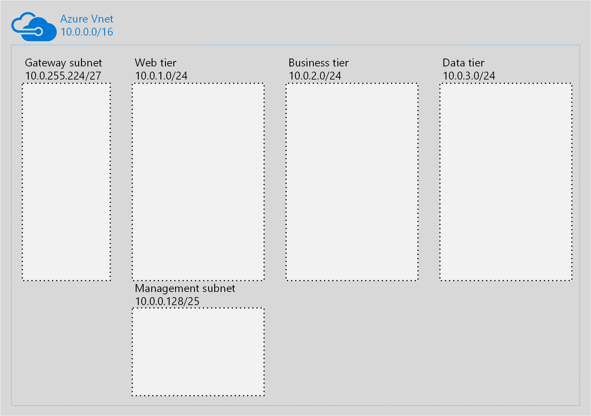
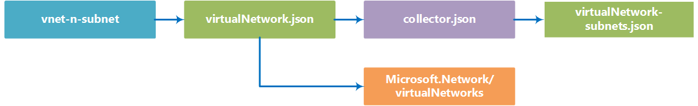

# vnet-n-subnet

You can use the vnet-n-subnet building block to deploy an [Azure virtual network (VNet)](https://azure.microsoft.com/en-us/documentation/articles/virtual-networks-overview/). This building block deploys only a virtual network, without any connected resources. The main difference between using this building block and the [Virtual Networks](https://azure.microsoft.com/en-us/documentation/articles/resource-groups-networking/#virtual-network) resource in the Network Resource Provider is that you cannot specify NSGs and UDRs in this block. These resources have a building block of their own, and do not require redefining a virtual network when created or modified. You can find these blocks here: 

- [Network Security Groups](https://github.com/mspnp/template-building-blocks/tree/master/scenarios/networkSecurityGroups)
- [User Defined Routes](https://github.com/mspnp/template-building-blocks/tree/master/scenarios/userDefinedRoutes)  

**Note** We chose to have separate building block for NSGs and UDRs so that these can be applied individually, without redefining the entire virtual network. Most deployments use extensions that require access to the Internet during deployment. By separating these blocks, you can deploy the VNet and your VMs, and then tighten security with NSGs and UDRs.

## Parameters

You only need to specify one parameter in this building block, named **virtualNetworkSettings**. This parameter is an object that contains the following properties:

- **name**  
   Required. Name of the virtual network you will create, as seen in the example below.  
	```json
	"name": "bb-dev-vnet"
	```
- **addressPrefixes**  
  Required. Defines the CIDR address blocks for the entire VNet. Supports multiple CIDR prefixes.  
  ```json
  "addressPrefixes": [ "10.0.0.0/16" ]
  ```

- **subnets**  
Required. The subnets property requires at least one subnet defined for the VNet. Multiple subnets are supported, as long as they all fit within the address range you specified in the addressPrefixes property. Each subnet requires an entry with the following properties:
   - **name** - Required. Name of the subnet.
   - **addressPrefix** - Required. CIDR address block for the subnet (must be valid within the VNet address space definition).  
   ```json
   "subnets": [
     {
       "name": "privateSub", 
       "addressPrefix": "10.0.0.0/24"
     }, 
     {
       "name": "publicSub", 
       "addressPrefix": "10.0.1.0/24"
     }
   ]
   ```
- **dnsServers**  
  Required. Defines one or more custom DNS Server address for the VNet. 
  ```json
  "dnsServers": ["10.0.0.220","10.0.1.233"]
  ```
  **Note** Leave the **dnsServers** property blank, as shown below, to use Azure internal name resolution. 
  ```json 
  "dnsServers": [ ] 
  ```

## Sample parameters file

The following parameters file will create a VNet with subnets suitable for a three-tiered architecture, a management subnet, and a gateway subnet:

```json
{
  "$schema": "http://schema.management.azure.com/schemas/2015-01-01/deploymentParameters.json#",
  "contentVersion": "1.0.0.0",
  "parameters": {
    "virtualNetworkSettings": {
      "value": {
        "name": "bb-dev-vnet",
        "addressPrefixes": [ "10.0.0.0/16" ],
        "subnets": [
          {
            "name": "web",
            "addressPrefix": "10.0.1.0/24"
          },
          {
            "name": "biz",
            "addressPrefix": "10.0.2.0/24"
          },
          {
            "name": "data",
            "addressPrefix": "10.0.3.0/24"
          },
          {
            "name": "management",
            "addressPrefix": "10.0.0.128/25"
          },
          {
            "name": "GatewaySubnet",
            "addressPrefix": "10.0.255.224/27"
          }
        ],
        "dnsServers": [ ]
      }
    }
  }
}
```
These parameters will create a VNet like the one below (minus the various VM's, availability sets, and gateways):



## Deployment

You can deploy a building block by using the Azure portal, PowerShell, or Azure CLI. The examples below show how to deploy the building block using the sample parameters file above.

### Azure portal

Note that the building block deployment process will require you store your parameters file in a location with a publicly available URI, which you provide during deployment.

[](https://portal.azure.com/#create/Microsoft.Template/uri/https%3A%2F%2Fraw.githubusercontent.com%2Fmspnp%2Ftemplate-building-blocks%2Fmaster%2Fscenarios%2Fvnet-n-subnet%2Fazuredeploy.json)  

1. Click the above deployment button, the Azure portal will be opened.
1. In the deployment's **TEMPLATEPARAMETERURI** parameter, specify the public URI where your parameters file is located. 
2. Specify or create the Resource Group where you want the VNet deployed to.
3. Click the **Create** button.

### PowerShell

You can use the **New-AzureRmResourceGroupDeployment** to deploy the building block template using a parameter file located at a publicly available URI.

1. Upload a parameters file to a location with a publicly available URI.
2. If you do not have an existing resource group, run the **New-AzureRmResourceGroup** cmdlet as shown below.
```PowerShell
New-AzureRmResourceGroup -Location <Target Azure Region> -Name <Resource Group Name> 
```
3. Run the **New-AzureRmResourceGroupDeployment** cmdlet as shown below.
```PowerShell
New-AzureRmResourceGroupDeployment -ResourceGroupName <Resource Group Name>
  -TemplateUri https://raw.githubusercontent.com/mspnp/template-building-blocks/master/scenarios/vnet-n-subnet/azuredeploy.json 
  -templateParameterUriFromTemplate <URI of parameters file>
```

**Example**  
The cmdlet below creates a resource group named **app1-rg** in the **westus** location, and then deploys vnet-n-subnet building block using a parameter file hosted in Azure blob storage.

```PowerShell
New-AzureRmResourceGroup -Location westus -Name app1-rg 
New-AzureRmResourceGroupDeployment -ResourceGroupName app1-rg -TemplateUri https://raw.githubusercontent.com/mspnp/template-building-blocks/master/scenarios/vnet-n-subnet/azuredeploy.json   -templateParameterUriFromTemplate http://buildingblocksample.blob.core.windows.net/building-block-params/vnet.parameters.json
```

### Azure CLI

To deploy the building block using a parameters file available from a URI:

1. Upload a parameters file to a location with a publicly available URL.
2. If you do not have an existing resource group, create a new one using the following command:
```AzureCLI
  azure group create -n <Resource Group Name> -l <Target Azure Region>
```

  
3. Run the command shown below to deploy the VNet
```AzureCLI
azure config mode arm
azure group deployment create <Resource Group Name>
  --template-uri https://raw.githubusercontent.com/mspnp/template-building-blocks/master/scenarios/vnet-n-subnet/azuredeploy.json 
  -p "{\"templateParameterUri\":{\"value\":\"<parameters File Public URI>\"}}"
```

**Example**  
The command below creates a resource group named **app1-rg** in the **westus** location, and then deploys a vnet-n-subnet building block using a parameter file hosted in Azure blob storage.

```AzureCLI
azure group create -n "app1-rg" -l "West US"
azure config mode arm
azure group deployment create app1-rg --template-uri https://raw.githubusercontent.com/mspnp/template-building-blocks/master/scenarios/vnet-n-subnet/azuredeploy.json -p "{\"templateParameterUri\":{\"value\":\"http://buildingblocksample.blob.core.windows.net/building-block-params/vnet.parameters.json\"}}"
```

## Extending the building block

You can extend existing building blocks, and create your own building blocks. Each building block is created using a set of templates. The flowchart below represents the different templates used to create the load balancer building block.

