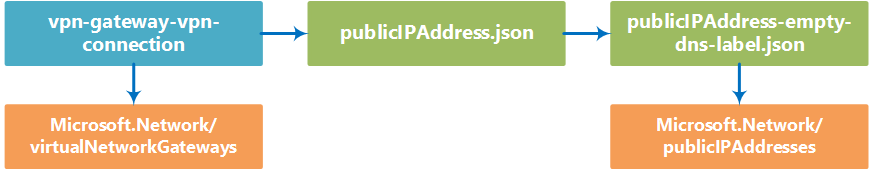

# vpn-gateway-vpn-connection

You can use the vpn-gateway-vpn-connection template building block to deploy a [VPN Gateway](https://azure.microsoft.com/en-us/documentation/articles/vpn-gateway-about-vpngateways/) to an [Azure virtual network (VNet)](https://azure.microsoft.com/en-us/documentation/articles/resource-groups-networking/#virtual-network). It creates a virtual network gateway, an associated public IP address, and configures the settings related to your local network gateway.

The block supports the creation of both conventional VPN and ExpressRoute gateway connections. Note that to deploy this building block you need to have a pre-existing VNet with a subnet named "GatewaySubnet".<!-- this is listed as a requirement on the VPN faq page, so I am assuming it's still a requirement with this building block--> If you don't have a VNet with a gateway subnet set up, you can use the [vnet-n-subnet](https://github.com/mspnp/template-building-blocks/tree/master/scenarios/vnet-n-subnet) building block to create one.


## Parameters

You need to specify three parameters in this building block, named **virtualNetworkSettings**, **virtualNetworkGatewaySettings**, **connectionSettings**.
 
### virtualNetworkSettings
The virtualNetworkSettings parameter is an object that specifies the VNet and resource group where the new VPN gateway is deployed. It contains the following properties:

- **name**  
   Required. Name of the VNet that the VPN gateway will be created in.   
	```json
	"name": "bb-dev-vnet"
	```

- **resourceGroup**  
Required. Azure Resource Group the that the new VPN gateway belongs to.  
  ```json
  "resourceGroup": "bb-dev-rg"
  ```

### virtualNetworkGatewaySettings
The virtualNetworkGatewaySettings parameter allows you to configure the virtual gateway device the building block will deploy. It contains the following properties:

- **name**  
  Required. Defines the name of the virtual network gateway  
  ```json
  "name": "bb-hybrid-vpn-vgw"
  ```

- **gatewayType**    
    Required. Type of gateway to create. ("Vpn" or "ExpressRoute")
    ```json
    "gatewayType": "Vpn"
    ```
- **vpnType**  
  Required. Type of VPN routing. ("RouteBased" or "PolicyBased")
  ```json
  "vpnType": "RouteBased"
  ```

- **sku**  
  Required. The gateway SKU. ("Standard", "High Performance", or "Basic")
  ```json
  "sku": "Standard"
  ```

### connectionSettings
The connectionSettings parameter configures the VPN connection, local network gateway, or ExpressRoute settings created by this building block. it contains the following parameters:

- **name**  
Required. Name of the VPN connection.
  ```json
  "name": "bb-hybrid-vpn-cn"
  ```
- **connectionType**  
Required. VPN connection type. ("IPsec", or "ExpressRoute") 
  ```json
  "connectionType": "IPsec"
  ```
- **sharedKey**  
Optional. Connection pre-shared key. (only for IPsec connections) 
  ```json
  "sharedKey": "123secret"
  ```

- **virtualNetworkGateway1**  
Required. The virtualNetworkGateway1 parameter specifies what virtual network gateway the connection is associated with. It contains a single property:
  - **name** - Required. Name of the virtual network gateway the connection is associated with. Should match the name specified in the virtualNetworkGateway parameter.    
  ```json
  "virtualNetworkGateway1": {
    "name": "bb-hybrid-vpn-vgw"
  }
  ```
- **localNetworkGateway**  
Optional. The localNetworkGateway parameter configures the local network gateway used by the VPN connection, and is only used for IPsec connections. It contains the following properties:
  - **name** - Required. Name of the local network gateway to create. 
  - **ipAddress** - Required. IP address of the gateway server on your local network.
  - **addressPrefixes**  - Required. An array of one or more CIDR blocks, defining what IP addresses get traffic routed to your local network.  
  *Note*: your local IP ranges cannot overlap with those defined for your Azure VNet.  
  ```json
  "localNetworkGateway": {
    "name": "bb-hybrid-vpn-lgw",
    "ipAddress": "40.50.60.70",
    "addressPrefixes": [ "192.168.2.0/24", "10.0.8.0/24" ]
  }
  ```
- **expressRouteCircuit**  
Optional. The expressRouteCircuit parameter provides the configuration information for ExpressRoute connections. It should only be included in your JSON parameters when using ExpressRoute. It contains a single property:
  - **name** - Required. Name of the ExpressRoute circuit the connection will use.
   ```json
  "expressRouteCircuit": {
    "name": "bb-hybrid-vpn-er-erc"
  }
  ```


## Example parameters file

The following parameters file will create a virtual gateway device connecting to a local network over a IPsec VPN connection:
 
```json
{
  "$schema": "http://schema.management.azure.com/schemas/2015-01-01/deploymentParameters.json#",
  "contentVersion": "1.0.0.0",
  "parameters": {
    "virtualNetworkSettings": {
      "value": {
        "name": "bb-dev-vnet",
        "resourceGroup": "bb-vpn-rg"
      }
    },
    "virtualNetworkGatewaySettings": {
      "value": {
        "name": "bb-hybrid-vpn-vgw",
        "gatewayType": "Vpn",
        "vpnType": "RouteBased",
        "sku": "Standard"
      }
    },
    "connectionSettings": {
      "value": {
        "name": "bb-hybrid-vpn-cn",
        "connectionType": "IPsec",
        "sharedKey": "123secret",
        "virtualNetworkGateway1": {
          "name": "bb-hybrid-vpn-vgw"
        },
        "localNetworkGateway": {
          "name": "bb-hybrid-vpn-lgw",
          "ipAddress": "40.50.60.70",
          "addressPrefixes": [ "10.0.8.0/24" ]
        }
      }
    }
  }
}

```


<!--

 -->


## Deployment

You can deploy a building block by using the Azure portal, PowerShell, or Azure CLI. The examples below show how to deploy the building block using the sample parameters file above.

### Azure portal

Note that the building block deployment process will require you store your parameters file in a location with a publicly available URI, which you provide during deployment.

[](https://portal.azure.com/#create/Microsoft.Template/uri/https%3A%2F%2Fraw.githubusercontent.com%2Fmspnp%2Ftemplate-building-blocks%2Fmaster%2Fscenarios%2Fvpn-gateway-vpn-connection%2Fazuredeploy.json)  

1. Click the above deployment button, the Azure portal will be opened.
1. In the deployment's **TEMPLATEPARAMETERURI** parameter, specify the public URI where your parameters file is located. 
2. Specify or create the Resource Group where you want the VNet deployed to.
3. Click the **Create** button.

### PowerShell

You can use the **New-AzureRmResourceGroupDeployment** to deploy the building block template using a parameter file located at a publicly available URI.

1. Upload a parameters file to a location with a publicly available URI.
2. Run the **New-AzureRmResourceGroupDeployment** cmdlet as shown below.
```PowerShell
New-AzureRmResourceGroupDeployment -ResourceGroupName <Resource Group Name>
  -TemplateUri https://raw.githubusercontent.com/mspnp/template-building-blocks/master/scenarios/vpn-gateway-vpn-connection/azuredeploy.json 
  -templateParameterUriFromTemplate <URI of parameters file>
```

**Example**  
The cmdlet below deploys a vpn-gateway-vpn-connection building block to the **app1-rg** resource group using a parameter file hosted in Azure blob storage.

```PowerShell
New-AzureRmResourceGroupDeployment -ResourceGroupName app1-rg -TemplateUri https://raw.githubusercontent.com/mspnp/template-building-blocks/master/scenarios/vpn-gateway-vpn-connection/azuredeploy.json -templateParameterUriFromTemplate http://buildingblocksample.blob.core.windows.net/building-block-params/vpn.parameters.json
```

### Azure CLI

To deploy the building block using a parameters file available from a URI:

1. Upload a parameters file to a location with a publicly available URL.
2. Run the command shown below to deploy the VNet
```AzureCLI
azure config mode arm
azure group deployment create <Resource Group Name>
  --template-uri https://raw.githubusercontent.com/mspnp/template-building-blocks/master/scenarios/vpn-gateway-vpn-connection/azuredeploy.json 
  -p "{\"templateParameterUri\":{\"value\":\"<parameters File Public URI>\"}}"
```

**Example**  
The command below deploys a vpn-gateway-vpn-connection building block to the **app1-rg** resource group using a parameter file hosted in Azure blob storage.

```AzureCLI
azure config mode arm
azure group deployment create app1-rg --template-uri https://raw.githubusercontent.com/mspnp/template-building-blocks/master/scenarios/vpn-gateway-vpn-connection/azuredeploy.json -p "{\"templateParameterUri\":{\"value\":\"http://buildingblocksample.blob.core.windows.net/building-block-params/udr.parameters.json\"}}"
```

## Extending the building block

You can extend existing building blocks, and create your own building blocks. Each building block is created using a set of templates. The flowchart below represents the different templates used to create the connection building block.


